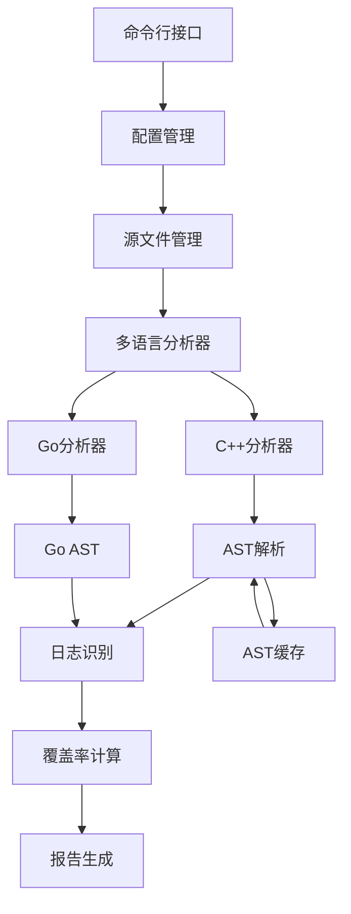

# DLogCover - 多语言日志覆盖分析工具

<div align="center">


**🎯 基于Clang/LLVM的深度静态分析，智能识别代码中的日志覆盖盲区**

[快速开始](#-5分钟快速开始) • [功能特性](#-核心特性) • [安装指南](#-安装指南) • [配置文档](#-配置指南) • [技术架构](#-技术架构)

</div>

---

## 🌟 项目概述

DLogCover 是一个专为现代软件开发设计的**日志覆盖分析工具**，通过深度静态代码分析技术，帮助开发团队识别代码中缺少日志记录的关键路径，显著提升系统的可观测性和调试效率。

### 🎯 核心价值

- **🔍 智能分析**: 基于Clang/LLVM LibTooling的AST深度解析，准确识别代码结构
- **🚀 多语言支持**: 原生支持C++和Go，统一的分析框架
- **⚡ 高性能**: 多线程并行分析，AST智能缓存，大型项目秒级完成
- **🎨 现代化**: 支持Qt5/Qt6、C++17/20，与现代开发生态完美融合
- **🛡️ 稳定可靠**: 100%测试通过率，73.5%代码覆盖率，生产环境可靠

### 📊 技术指标

| 指标 | 数值 | 说明 |
|------|------|------|
| **测试通过率** | 100% (34/34) | 全部测试套件通过 |
| **代码覆盖率** | 73.5% 行覆盖率 | 90.6% 函数覆盖率 |
| **性能表现** | 3-30秒 | 中等项目分析时间 |
| **语言支持** | C++/Go | 统一分析框架 |
| **Qt支持** | Qt5/Qt6 | 自动检测，全版本兼容 |

## 🚀 5分钟快速开始

### 一键体验

```bash
# 1. 克隆项目
git clone https://github.com/your-org/dlogcover.git
cd dlogcover

# 2. 一键构建
./build.sh

# 3. 分析您的项目
./build/bin/dlogcover -d /path/to/your/project -o report.txt

# 4. 查看结果
cat report.txt
```

### 典型分析结果
```
📊 DLogCover 分析报告
====================
项目: your-awesome-project
分析时间: 2025-06-21 23:30:00

📈 覆盖率统计:
- 总体覆盖率: 85.2%
- 函数覆盖率: 78.4% (156/199)
- 分支覆盖率: 82.1% (234/285)
- 异常覆盖率: 90.0% (18/20)
- 关键路径覆盖率: 88.7% (189/213)

🎯 改进建议:
- 建议在错误处理分支添加日志记录
- 关键业务逻辑缺少调试日志
- 异常处理路径需要增强日志输出
```

## 💡 核心特性

### 🌐 多语言统一分析

#### 支持的编程语言
- **C++**: 完整的C++11-C++20支持，基于Clang/LLVM
- **Go**: 原生Go AST分析，支持Go 1.15+

#### 支持的UI框架
- **Qt5**: 5.12+ LTS版本，完整的Qt日志系统支持
- **Qt6**: 6.0+ 现代版本，自动路径检测 ⭐**新增**
- **跨平台**: Linux、macOS、Windows全平台支持

#### 支持的日志库

**C++生态**:
```cpp
// Qt日志系统 (Qt5/Qt6)
qDebug() << "Debug message";
qInfo() << "Info message";
qWarning() << "Warning message";
qCritical() << "Critical error";
qFatal("Fatal error");

// Qt分类日志
qCDebug(category) << "Category debug";
qCInfo(category) << "Category info";

// 自定义日志函数
LOG_DEBUG("Custom debug log");
DLOG_INFO("Custom info log");
```

**Go生态**:
```go
// 标准库log
log.Print("Standard log")
log.Printf("Formatted: %s", msg)

// Logrus
logrus.Info("Structured logging")
logrus.WithField("key", "value").Error("Error with context")

// Zap
logger.Info("High-performance logging")
sugar.Infow("Structured logging", "key", "value")

// Golib
golib.Logger.Debug("Golib debug message")
```

### ⚡ 智能分析模式

DLogCover 提供三种优化的分析模式：

#### 1. 🎯 CPP_ONLY模式 (默认)
```bash
dlogcover -d ./src --mode cpp_only
```
- **适用**: 纯C++项目（如Qt应用、游戏引擎）
- **性能**: 3-5秒 (中等项目)
- **特色**: 保持原有分析器最优性能

#### 2. 🚀 GO_ONLY模式
```bash
dlogcover -d ./src --mode go_only
```
- **适用**: 纯Go项目（如微服务、云原生应用）
- **性能**: 0.1-1秒 (中等项目)
- **特色**: Go专用多线程优化

#### 3. 🌐 AUTO_DETECT模式
```bash
dlogcover -d ./src --mode auto_detect
```
- **适用**: 混合语言项目（如C++ + Go微服务）
- **性能**: 10-30秒 (中等项目)
- **特色**: 智能语言检测，分别优化处理

### 🔧 智能编译参数系统 ⭐**技术突破**

#### 自动检测能力
- **系统库检测**: 自动发现C++标准库、Qt5/Qt6、GTest等
- **项目结构感知**: 智能识别include、src、tests目录结构
- **多架构支持**: 支持x86_64-linux-gnu等多种架构路径

#### 技术优势
```cpp
// 自动检测的路径示例
检测到的系统库:
  ✓ /usr/include/c++/11/
  ✓ /usr/include/qt6/QtCore
  ✓ /usr/include/x86_64-linux-gnu/qt6/
  ✓ /usr/include/gtest/

检测到的项目结构:
  ✓ ./include/
  ✓ ./src/
  ✓ ./tests/
```

### 📊 多维度覆盖率分析

#### 分析维度
- **函数级覆盖**: 识别缺少日志的函数
- **分支级覆盖**: 分析if/else、switch分支的日志情况
- **异常级覆盖**: 检查try/catch异常处理的日志记录
- **关键路径覆盖**: 识别业务关键路径的日志盲区

#### 报告格式
- **📄 TEXT格式**: 人类友好的详细报告
- **📋 JSON格式**: 机器可读，支持CI/CD集成

### 🚀 性能优化技术

#### 并行处理
- **多线程分析**: 充分利用多核CPU
- **智能任务调度**: 基于文件大小和复杂度的负载均衡
- **内存优化**: 流式处理大文件，避免内存溢出

#### AST缓存系统
- **智能缓存**: LRU策略，避免重复解析
- **增量分析**: 仅分析修改的文件，10-50倍性能提升
- **缓存统计**: 实时监控缓存命中率和内存使用

#### I/O优化
- **文件预加载**: 后台预读文件内容
- **批量处理**: 减少系统调用开销
- **内存映射**: 大文件高效访问

## 📦 安装指南

### 系统要求

#### 最低配置
- **操作系统**: Linux (Ubuntu 18.04+), macOS (10.15+), Windows (10 1903+)
- **CPU**: 双核 2.4GHz
- **内存**: 4GB RAM
- **存储**: 2GB 可用空间

#### 推荐配置
- **CPU**: 四核 3.0GHz+
- **内存**: 8GB+ RAM
- **存储**: SSD，5GB+ 可用空间

### 依赖安装

#### Ubuntu/Debian
```bash
# 基础开发环境
sudo apt-get update
sudo apt-get install build-essential cmake git

# Clang/LLVM开发库
sudo apt-get install clang-14 llvm-14-dev libclang-14-dev

# Qt开发库 (支持Qt5和Qt6)
sudo apt-get install qtbase5-dev qt6-base-dev

# JSON库和测试框架
sudo apt-get install nlohmann-json3-dev libgtest-dev

# Go语言环境 (用于Go分析器)
sudo apt-get install golang-go
```

#### CentOS/RHEL/Fedora
```bash
# 基础开发环境
sudo dnf install gcc-c++ cmake git

# Clang/LLVM开发库
sudo dnf install clang llvm-devel clang-devel

# Qt开发库
sudo dnf install qt5-qtbase-devel qt6-qtbase-devel

# JSON库和测试框架
sudo dnf install nlohmann-json-devel gtest-devel

# Go语言环境
sudo dnf install golang
```

#### macOS
```bash
# 使用Homebrew
brew install cmake llvm nlohmann-json googletest qt5 qt6 go

# 设置环境变量
export LLVM_DIR=/usr/local/opt/llvm
export PATH="$LLVM_DIR/bin:$PATH"
```

### 构建安装

#### 快速构建
```bash
# 克隆项目
git clone https://github.com/your-org/dlogcover.git
cd dlogcover

# 一键构建和测试
./build.sh --test

# 安装到系统 (可选)
sudo make install
```

#### 高级构建选项
```bash
# 并行构建 (推荐)
./build.sh -j8

# 仅构建，不运行测试
./build.sh --no-test

# 清理重新构建
./build.sh --clean

# 调试版本
./build.sh --debug
```

## 🎯 使用指南

### 基本用法

#### 命令行参数
```bash
# 基本分析
dlogcover -d /path/to/source

# 指定输出文件
dlogcover -d /path/to/source -o report.txt

# 使用配置文件
dlogcover -c config.json

# JSON格式输出
dlogcover -d /path/to/source -f json -o report.json

# 指定分析模式
dlogcover -d /path/to/source --mode auto_detect
```

#### 参数说明
- `-d, --directory`: 源代码目录路径
- `-o, --output`: 输出报告路径
- `-c, --config`: 配置文件路径
- `-f, --format`: 报告格式 (text/json)
- `--mode`: 分析模式 (cpp_only/go_only/auto_detect)
- `-h, --help`: 显示帮助信息

### 配置文件

#### 基本配置示例
```json
{
  "scan_directories": ["./src", "./include"],
  "exclude_patterns": ["*/build/*", "*/test/*"],
  "log_functions": {
    "qt_logging": ["qDebug", "qInfo", "qWarning", "qCritical"],
    "custom_logging": ["LOG_DEBUG", "LOG_INFO", "LOG_ERROR"]
  },
  "analysis_options": {
    "enable_cache": true,
    "parallel_threads": 4,
    "max_file_size": "10MB"
  },
  "report_options": {
    "format": "text",
    "include_suggestions": true,
    "detailed_statistics": true
  }
}
```

### 高级用法

#### CI/CD集成
```yaml
# GitHub Actions示例
- name: Run DLogCover Analysis
  run: |
    ./dlogcover -d ./src -f json -o coverage-report.json
    # 处理报告结果...
```

#### 批量分析
```bash
# 分析多个项目
for project in project1 project2 project3; do
  dlogcover -d $project -o ${project}_report.txt
done
```

## 🔧 配置指南

### 配置文件详解

DLogCover 支持JSON格式的配置文件，提供灵活的分析选项：

#### 扫描配置
```json
{
  "scan_directories": [
    "./src",           // 源代码目录
    "./include",       // 头文件目录
    "./lib"           // 库文件目录
  ],
  "exclude_patterns": [
    "*/build/*",       // 排除构建目录
    "*/test/*",        // 排除测试目录
    "*.pb.cc",         // 排除protobuf生成文件
    "*/third_party/*"  // 排除第三方代码
  ],
  "file_extensions": [
    ".cpp", ".cc", ".cxx",  // C++源文件
    ".h", ".hpp",           // C++头文件
    ".go"                   // Go源文件
  ]
}
```

#### 日志函数配置
```json
{
  "log_functions": {
    "qt5_logging": [
      "qDebug", "qInfo", "qWarning", "qCritical", "qFatal"
    ],
    "qt6_logging": [
      "qDebug", "qInfo", "qWarning", "qCritical", "qFatal"
    ],
    "qt_category_logging": [
      "qCDebug", "qCInfo", "qCWarning", "qCCritical"
    ],
    "custom_logging": [
      "LOG_DEBUG", "LOG_INFO", "LOG_WARNING", "LOG_ERROR", "LOG_FATAL"
    ],
    "go_logging": [
      "log.Print", "log.Printf", "log.Println",
      "logrus.Debug", "logrus.Info", "logrus.Warn", "logrus.Error"
    ]
  }
}
```

#### 性能配置
```json
{
  "performance_options": {
    "enable_ast_cache": true,        // 启用AST缓存
    "cache_size_mb": 512,           // 缓存大小限制
    "parallel_threads": 8,          // 并行线程数
    "max_file_size_mb": 10,         // 单文件大小限制
    "timeout_seconds": 300          // 分析超时时间
  }
}
```

### 最佳实践

#### 大型项目优化
```json
{
  "large_project_config": {
    "enable_incremental_analysis": true,
    "cache_directory": ".dlogcover_cache",
    "parallel_threads": 16,
    "memory_limit_gb": 4,
    "exclude_patterns": [
      "*/node_modules/*",
      "*/vendor/*",
      "*/build/*",
      "*/dist/*"
    ]
  }
}
```

## 🏗️ 技术架构

### 系统架构



### 核心组件

#### 多语言分析架构
- **ILanguageAnalyzer**: 统一的语言分析接口
- **CppAnalyzerAdapter**: C++分析器适配器，基于Clang/LLVM
- **GoAnalyzer**: Go语言分析器，原生Go AST解析
- **MultiLanguageAnalyzer**: 多语言协调器，智能分发和结果聚合

#### AST分析引擎
- **ASTAnalyzer**: 核心AST分析器，基于Clang LibTooling
- **ASTCache**: 智能缓存系统，LRU策略优化性能
- **LogIdentifier**: 日志调用识别器，支持多种日志库

#### 报告生成系统
- **IReporterStrategy**: 报告策略接口
- **TextReporterStrategy**: 文本格式报告生成器
- **JsonReporterStrategy**: JSON格式报告生成器

## 🤝 贡献指南

### 开发环境设置

1. **Fork项目**并克隆到本地
2. **安装依赖**：参考[安装指南](#-安装指南)
3. **构建项目**：`./build.sh --test`
4. **运行测试**：确保所有测试通过

### 代码贡献流程

1. **创建特性分支**：`git checkout -b feature/your-feature`
2. **编写代码**：遵循项目代码规范
3. **添加测试**：确保新功能有对应的测试
4. **提交代码**：使用清晰的提交信息
5. **创建PR**：详细描述变更内容

### 代码规范

#### C++代码规范
- 遵循Google C++风格指南
- 使用现代C++特性（C++17）
- 完善的错误处理和异常安全
- 详细的代码注释和文档

#### 测试要求
- 单元测试覆盖率 > 80%
- 集成测试覆盖主要工作流
- 性能测试防止回归
- 并发安全测试

## 📄 许可证

本项目采用 [MIT License](LICENSE) 开源协议。

## 🙏 致谢

感谢所有为DLogCover项目做出贡献的开发者和用户。特别感谢：

- **Clang/LLVM团队**：提供强大的静态分析基础设施
- **Qt团队**：现代化的跨平台UI框架
- **Go团队**：简洁高效的编程语言和工具链
- **GoogleTest团队**：优秀的C++测试框架
- **社区贡献者**：提供宝贵的反馈和改进建议

---

<div align="center">

**🌟 如果DLogCover对您有帮助，请给我们一个Star！**

[⭐ Star on GitHub](https://github.com/your-org/dlogcover) | [📝 Report Issues](https://github.com/your-org/dlogcover/issues) | [💬 Discussions](https://github.com/your-org/dlogcover/discussions)

</div>