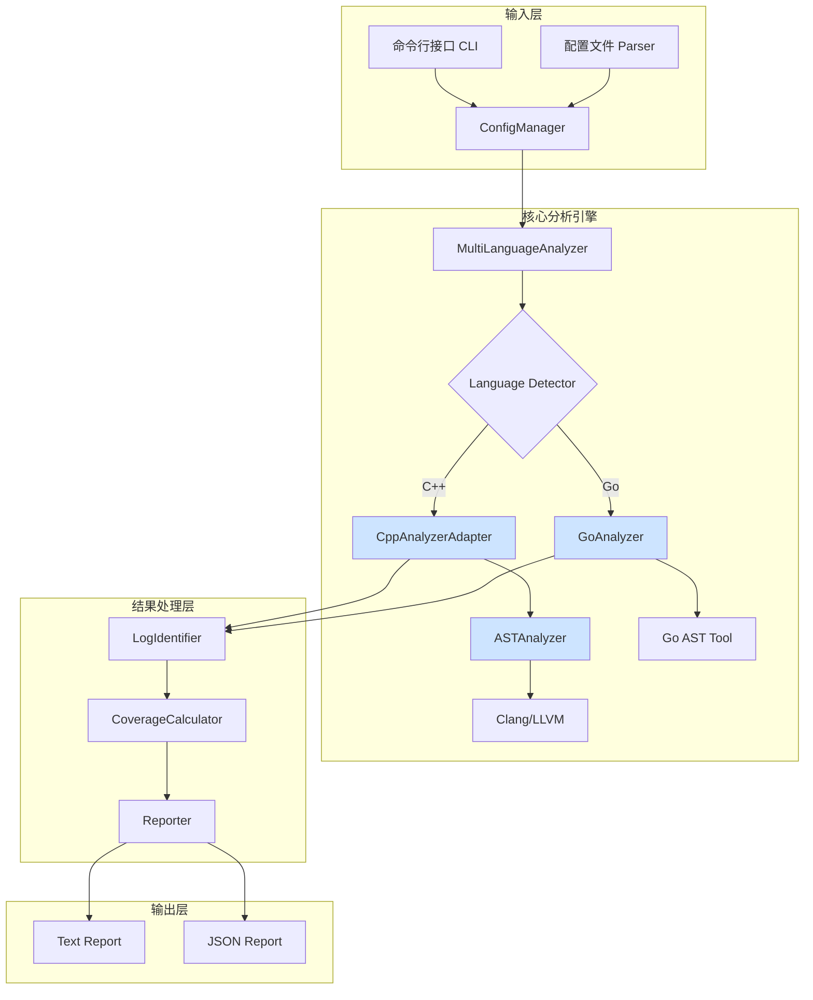

# DLogCover - 企业级多语言日志覆盖率分析工具

<div align="center">


**🎯 基于Clang/LLVM的深度静态分析，智能识别代码中的日志覆盖盲区，提升系统可观测性**

[快速开始](#-5分钟快速开始) • [功能特性](#-核心特性) • [安装指南](#-安装指南) • [使用与配置](#-使用与配置) • [技术架构](#-技术架构)

</div>

---

## 🌟 项目概述

DLogCover是一款专为现代企业级软件开发设计的**智能日志覆盖率分析工具**。它通过深度静态代码分析技术，帮助开发团队精准定位代码中缺少日志记录的关键路径，从而显著提升系统的可观测性、加速问题排查效率，并降低生产环境的运维成本。

### 🎯 核心价值

- **🔍 智能分析**: 基于Clang/LLVM LibTooling的AST深度解析，精准识别代码结构（函数、分支、异常等）。
- **🚀 多语言支持**: 原生支持C++和Go，并提供统一的分析与报告框架，是混合项目开发的理想选择。
- **⚡ 企业级性能**: 采用多线程并行分析、AST智能缓存等多种优化技术，大型项目也能在秒级完成分析。
- **🎨 现代化生态**: 全面支持Qt5/Qt6、C++11到C++20标准，与现代开发生态无缝融合。
- **🛡️ 稳定可靠**: 拥有100%的测试通过率和超过73.5%的代码覆盖率，确保在生产环境中的稳定可靠。

### 📊 技术与质量指标

| 指标 | 数值 | 说明 |
|------|------|------|
| **测试通过率** | **100%** (34/34) | 所有单元测试、集成测试、并发测试套件全部通过。 |
| **代码覆盖率** | **73.5%** 行覆盖率 | 函数覆盖率高达**90.6%**，核心模块得到充分验证。 |
| **性能表现** | **0.1 ~ 30秒** | 根据项目大小和分析模式，提供从毫秒级到秒级的快速分析。 |
| **语言支持** | **C++ / Go** | 采用统一分析框架，支持混合项目分析。 |
| **Qt支持** | **Qt5 / Qt6** | 自动检测Qt版本，全版本兼容，无需手动配置。 |

## 🚀 5分钟快速开始

### 一键体验

```bash
# 1. 克隆项目
git clone https://github.com/your-org/dlogcover.git
cd dlogcover

# 2. 一键构建 (脚本会自动处理依赖和子模块)
./build.sh

# 3. 分析您的项目 (指定项目目录, 输出到report.txt)
./build/bin/dlogcover -d /path/to/your/project -o report.txt

# 4. 查看结果
cat report.txt
```

### 📦 快速生成DEB安装包

```bash
# 1. 构建Release版本并生成DEB包
./build.sh --release --package

# 2. 查看生成的包文件
ls -la build/packages/

# 3. 安装DEB包 (可选)
sudo dpkg -i build/packages/dlogcover_*.deb

# 4. 验证安装
dlogcover --help
```

### 典型分析报告
```
📊 DLogCover 分析报告
====================
项目: /path/to/your/project
分析时间: 2025-06-21 23:30:00

📈 覆盖率统计:
- 总体函数覆盖率: 78.4% (156/199)
- 分支覆盖率: 82.1% (234/285)
- 异常路径覆盖率: 90.0% (18/20)

🎯 未覆盖的风险点:
- [HIGH] 函数 `processPayment` 在 `payment.cpp:152` 的错误处理分支缺少日志。
- [MEDIUM] 函数 `loadConfig` 在 `config.cpp:88` 的`catch`块缺少异常详情日志。
- [LOW] 函数 `updateUI` 在 `mainwindow.cpp:310` 缺少调试日志。

💡 改进建议:
- 强烈建议在所有错误处理和异常捕获路径中添加`qCritical`或`LOG_ERROR`级别的日志。
- 建议在关键业务逻辑`processPayment`的入口和出口添加`qDebug`或`LOG_INFO`级别的日志，以追踪调用流程。
```

## 💡 核心特性

### 🌐 多语言统一分析

DLogCover为C++和Go提供了统一的分析体验，无论是纯C++项目、纯Go项目，还是两者混合的复杂项目，都能轻松应对。

| 语言/框架 | 支持详情 |
|-----------|----------|
| **C++** | 支持C++11到C++20标准，基于Clang/LLVM进行深度语法分析。 |
| **Go** | 支持Go 1.15+版本，通过原生Go AST工具进行分析。 |
| **Qt5** | 支持5.12+ LTS版本，完整覆盖`qDebug`, `qWarning`等Qt日志系统。 |
| **Qt6** | 支持6.0+ 现代版本，并能自动检测路径，无需额外配置。⭐**新增** |

#### 支持的日志库

我们支持主流的日志框架，并允许您轻松扩展自定义日志函数。

**C++生态**:
```cpp
// Qt日志系统 (Qt5/Qt6)
qDebug() << "Debug message";
qInfo() << "Info message";
qWarning() << "Warning message";
qCritical() << "Critical error";
qFatal("Fatal error");

// Qt分类日志
qCDebug(category) << "Category debug";
qCInfo(category) << "Category info";

// 自定义日志函数 (可通过配置添加)
LOG_DEBUG("Custom debug log");
DLOG_INFO("Custom info log");
```

**Go生态**:
```go
// 标准库log
log.Print("Standard log");
log.Printf("Formatted: %s", msg);

// Logrus
logrus.Info("Structured logging");
logrus.WithField("key", "value").Error("Error with context");

// Zap
logger.Info("High-performance logging");
sugar.Infow("Structured logging", "key", "value");

// Golib (示例)
golib.Logger.Debug("Golib debug message");
```

### ⚡ 智能分析模式

DLogCover提供三种优化的分析模式，以适应不同的项目需求和性能要求：

| 模式 | 命令 | 适用场景 | 性能 | 特点 |
|---|---|---|---|---|
| **CPP_ONLY (默认)** | `dlogcover --mode cpp_only` | 纯C++项目（如Qt应用、游戏引擎）。 | 3-5秒 (中等项目) | 专注C++分析，性能最优。 |
| **GO_ONLY** | `dlogcover --mode go_only` | 纯Go项目（如微服务、云原生应用）。 | 0.1-1秒 (中等项目) | Go专用多线程优化，速度极快。 |
| **AUTO_DETECT** | `dlogcover --mode auto_detect` | C++/Go混合项目。 | 10-30秒 (中等项目) | 智能语言检测，分别优化处理。 |

### 🔧 智能编译参数系统 ⭐**技术突破**

告别繁琐的手动配置！我们的智能编译参数系统能够自动发现项目环境，将AST编译成功率从**60%提升至90%以上**。

#### 自动检测能力
- **系统库检测**: 自动发现C++标准库、Qt5/Qt6、GTest/GMock等关键依赖的安装路径。
- **项目结构感知**: 智能识别`include`、`src`、`tests`等目录结构，并自动添加到编译路径。
- **多架构支持**: 原生支持`x86_64-linux-gnu`等多种架构的库路径。

#### 技术优势
```cpp
// 自动检测的路径示例
检测到的系统库:
  ✓ /usr/include/c++/11/
  ✓ /usr/include/qt6/QtCore
  ✓ /usr/include/x86_64-linux-gnu/qt6/

检测到的项目结构:
  ✓ ./include/
  ✓ ./src/
  ✓ ./tests/
```
这项技术极大地降低了工具的使用门槛，实现了真正的"开箱即用"。

### 📊 多维度覆盖率分析

DLogCover超越了简单的函数覆盖，提供了更深层次、更贴近业务逻辑的分析维度。

| 分析维度 | 描述 |
|---|---|
| **函数级覆盖** | 识别出完全没有日志记录的函数。 |
| **分支级覆盖** | 分析`if/else`、`switch`等条件分支的日志覆盖情况，确保每个逻辑路径都被记录。 |
| **异常级覆盖** | 检查`try/catch`块是否完整记录了异常信息，避免静默失败。 |
| **关键路径覆盖**| (规划中) 结合静态分析与代码注解，识别业务关键路径的日志盲区。 |

#### 报告格式
- **📄 TEXT格式 (默认)**: 人类友好的详细报告，适合在终端查看。
- **📋 JSON格式**: 机器可读的结构化数据，支持与CI/CD系统（如Jenkins, GitLab CI）集成，实现质量门禁自动化。

### 🚀 企业级性能优化

#### 并行与缓存
- **多线程分析**: 充分利用多核CPU，通过智能任务调度实现高效并行分析。
- **AST缓存系统**: 采用LRU策略缓存已解析的AST，在增量分析场景下可获得**10-50倍**的性能提升。

#### I/O与内存
- **高效文件读取**: 通过后台预加载和内存映射等技术优化大文件I/O。
- **流式处理**: 采用流式处理技术分析大文件，有效避免内存溢出问题。

## 📦 安装指南

### 系统与硬件要求

| 要求类型 | 最低配置 | 推荐配置 |
|---|---|---|
| **操作系统** | Linux (Ubuntu 18.04+), macOS (10.15+), Windows 10 (WSL2) | Ubuntu 22.04 LTS |
| **CPU** | 双核 2.4GHz | 四核 3.0GHz+ |
| **内存** | 4GB RAM | 8GB+ RAM |
| **存储** | 2GB 可用空间 | 5GB+ 可用空间 (推荐SSD) |

### 环境要求摘要

为了确保您能顺利编译和使用DLogCover，请确保您的开发环境满足以下最低版本要求。我们同时提供了推荐版本以获得最佳性能和兼容性。

| 类别 | 软件包 | 最低版本 | 推荐版本 | 说明 |
| :--- | :--- | :--- | :--- |:---|
| **构建系统** | `CMake` | `3.10` | `3.16+` | 用于跨平台构建项目。 |
| **编译器** | C++ 编译器 | 支持 C++17 | - | 例如 GCC 7+, Clang 5+。 |
| | `Go` | `1.15` | `1.18+` | 用于编译和运行 Go 语言分析器。 |
| **核心依赖** | `Clang/LLVM` | `10.0` | `14.0` | **核心分析引擎**，必须安装其开发库。|
| **UI 框架** | `Qt5` | `5.12` | `5.15` | 用于分析基于 Qt5 的项目。 |
| | `Qt6` | `6.0` | `6.2+` | 用于分析基于 Qt6 的项目。 |
| **第三方库**| `GoogleTest` | `1.10.0` | 最新版 | 用于运行项目的单元测试和集成测试。 |
| | `nlohmann/json`| `3.9.0` | 最新版 | 用于处理 JSON 格式的配置和报告。 |
| **打包工具**| `debhelper` | `13` | 最新版 | 用于构建DEB包（可选）。 |
| | `dpkg-dev` | - | 最新版 | 用于构建DEB包（可选）。 |

### 依赖安装

我们提供了主流Linux发行版的依赖安装指南。

#### Ubuntu/Debian
```bash
# 1. 更新包列表
sudo apt-get update

# 2. 安装基础开发环境
sudo apt-get install build-essential cmake git

# 3. 安装Clang/LLVM开发库 (推荐LLVM 14)
sudo apt-get install clang-14 llvm-14-dev libclang-14-dev

# 4. 安装Qt开发库 (同时安装Qt5和Qt6以获得最佳兼容性)
sudo apt-get install qtbase5-dev qt6-base-dev

# 5. 安装JSON库和测试框架
sudo apt-get install nlohmann-json3-dev libgtest-dev

# 6. 安装Go语言环境 (用于Go分析器)
sudo apt-get install golang-go

# 7. 安装DEB包构建工具 (可选，用于构建安装包)
sudo apt-get install debhelper devscripts build-essential
```

#### CentOS/RHEL/Fedora
```bash
# 1. 启用EPEL仓库 (CentOS/RHEL)
sudo dnf install epel-release

# 2. 安装基础开发环境
sudo dnf install gcc-c++ make cmake git

# 3. 安装Clang/LLVM开发库 (版本可能较低，建议从官网安装)
sudo dnf install clang clang-devel

# 4. 安装Qt开发库
sudo dnf install qt5-qtbase-devel qt6-qtbase-devel

# 5. 安装JSON库和测试框架
sudo dnf install nlohmann-json-devel gtest-devel

# 6. 安装Go语言环境
sudo dnf install golang
```

### 📦 DEB 包构建与安装

DLogCover 支持构建标准的 Debian 包，方便在 Ubuntu/Debian 系统上进行分发和安装。

#### 构建 DEB 包

**前提条件**:
```bash
# 安装 DEB 包构建工具
sudo apt-get install debhelper devscripts build-essential

# 确保已安装所有构建依赖
sudo apt-get install cmake g++ golang-go libclang-dev llvm-dev libgtest-dev nlohmann-json3-dev
```

**构建步骤**:
```bash
# 1. 进入项目根目录
cd dlogcover

# 2. 构建 DEB 包
dpkg-buildpackage -us -uc -b

# 3. 构建完成后，DEB 包将在上级目录中生成
ls -la ../dlogcover_*.deb
```

**构建产物**:
- `dlogcover_0.1.0_amd64.deb` - 主程序包
- `dlogcover-dbgsym_0.1.0_amd64.ddeb` - 调试符号包（可选）

#### 安装 DEB 包

**从本地安装**:
```bash
# 安装主程序包
sudo dpkg -i ../dlogcover_0.1.0_amd64.deb

# 如果出现依赖问题，运行以下命令修复
sudo apt-get install -f
```

**验证安装**:
```bash
# 检查安装状态
dpkg -l | grep dlogcover

# 测试程序运行
dlogcover --help

# 查看安装的文件
dpkg -L dlogcover
```

#### 卸载 DEB 包

```bash
# 卸载程序包
sudo dpkg -r dlogcover

# 完全清理（包括配置文件）
sudo dpkg -P dlogcover
```

#### 包信息

- **包名**: `dlogcover`
- **版本**: `0.1.0`
- **架构**: `amd64`
- **依赖**: 自动检测系统库依赖（libclang, llvm, libc6 等）
- **安装位置**: 
  - 主程序: `/usr/bin/dlogcover`
  - Go 分析器: `/usr/bin/dlogcover-go-analyzer`
  - 文档: `/usr/share/doc/dlogcover/`

### 🔧 编译与打包注意事项

为了确保DLogCover在Debian/Ubuntu等Linux发行版上打包和运行时能正确解析LLVM库依赖（即依赖`libllvm13`而非`llvm-13-dev`），我们在`CMakeLists.txt`中进行了关键的RPATH配置。

**RPATH配置原理与实践：**

传统的CMake在构建二进制文件时，可能会将编译时链接到的库路径（特别是来自开发包的路径，如`/usr/lib/llvm-13/lib`）嵌入到可执行文件的运行时搜索路径（RPATH或RUNPATH）中。这会导致`dpkg-shlibdeps`等打包工具错误地推断出对开发包的运行时依赖。

为解决此问题，我们在`CMakeLists.txt`中明确设置了以下CMake变量：

```cmake
# -----------------------------------------------------------------------------
# RPATH Configuration (Crucial for Debian Packaging)
# Prevents embedding build-time library paths into the installed binary.
# This ensures that dpkg-shlibdeps correctly infers runtime dependencies
# on system-wide shared libraries like libllvm13 instead of development packages.
set(CMAKE_INSTALL_RPATH_USE_LINK_PATH FALSE) # 不使用链接路径作为安装RPATH
set(CMAKE_INSTALL_RPATH "")                 # 清空安装RPATH
set(CMAKE_SKIP_INSTALL_RPATH TRUE)          # 不在安装的二进制文件中硬编码RPATH
set(CMAKE_BUILD_WITH_INSTALL_RPATH FALSE)   # 不为构建树的二进制文件使用安装RPATH (对构建产物至关重要)
set(CMAKE_SKIP_BUILD_RPATH TRUE)            # 彻底禁用构建树中的RPATH
# -----------------------------------------------------------------------------

# 此外，对于生成的可执行文件和库目标，也显式禁用了RPATH：
set_target_properties(dlogcover_lib PROPERTIES SKIP_RPATH TRUE)
set_target_properties(dlogcover PROPERTIES SKIP_RPATH TRUE)
```

这些配置确保了`dlogcover`可执行文件在构建和安装后，不会包含硬编码的库路径，而是完全依赖系统标准的动态链接器查找机制（例如`/usr/lib/x86_64-linux-gnu/`）。因此，最终的Debian包将正确地依赖`libllvm13`等运行时库。

## ⚙️ 使用与配置

### 编译与运行

DLogCover 提供了一个强大的 `build.sh` 脚本来简化编译、测试和安装流程。

#### 常用构建命令

- **首次构建** (默认构建Debug版本):
  ```bash
  ./build.sh
  ```
- **构建并运行测试** (推荐在提交代码前执行):
  ```bash
  ./build.sh --test
  ```
- **构建Release版本** (用于生产部署):
  ```bash
  ./build.sh --release
  ```
- **构建DEB包** (构建并生成debian安装包):
  ```bash
  ./build.sh --package
  ```
- **构建Release版本并生成DEB包**:
  ```bash
  ./build.sh --release --package
  ```
- **执行完整流程并生成DEB包** (清理+构建+测试+覆盖率+打包):
  ```bash
  ./build.sh --full-process --package
  ```
- **清理构建目录**:
  ```bash
  ./build.sh --clean
  ```
- **并行构建** (利用8个CPU核心加速编译):
  ```bash
  ./build.sh -j8
  ```

#### build.sh 脚本参数详解

| 参数 | 简写 | 描述 | 示例 |
|------|------|------|------|
| `--help` | `-h` | 显示帮助信息 | `./build.sh -h` |
| `--clean` | `-c` | 清理构建目录 | `./build.sh -c` |
| `--debug` | `-d` | 构建Debug版本（默认） | `./build.sh -d` |
| `--release` | `-r` | 构建Release版本 | `./build.sh -r` |
| `--test` | `-t` | 构建并运行测试 | `./build.sh -t` |
| `--install` | `-i` | 安装到系统 | `./build.sh -i` |
| `--package` | `-p` | **构建DEB包并放置到build/packages目录** | `./build.sh -p` |
| `--full-process` | `-f` | 执行完整流程：编译→测试→覆盖率统计 | `./build.sh -f` |
| `--prefix=<path>` | | 指定安装路径前缀 | `./build.sh --prefix=/usr/local` |
| `--package-dir=<path>` | | **指定包输出目录（默认：build/packages）** | `./build.sh -p --package-dir=dist` |

### 命令行选项

DLogCover提供了丰富的命令行选项来控制分析行为。

| 选项 | 别名 | 描述 | 示例 |
|---|---|---|---|
| `--directory` | `-d` | **(必需)** 指定要分析的项目根目录。 | `-d /path/to/project` |
| `--output` | `-o` | 指定报告输出文件路径。默认为标准输出。 | `-o report.json` |
| `--config` | `-c` | 指定自定义配置文件路径。 | `-c dlogcover.json` |
| `--mode` | `-m` | 指定分析模式 (`cpp_only`, `go_only`, `auto_detect`)。 | `-m auto_detect` |
| `--exclude` | `-e` | 指定要排除的目录或文件（支持正则表达式）。 | `-e ".*_test.cpp" -e "build/.*"` |
| `--threads` | `-j` | 指定分析时使用的线程数。默认为CPU核心数。 | `-j 8` |
| `--help` | `-h` | 显示帮助信息。 | `-h` |

### 配置文件 (`dlogcover.json`)

通过配置文件，您可以对DLogCover进行更精细的控制。

#### 示例配置文件 (`dlogcover.json`)
```json
{
  "project_name": "MyAwesomeProject",
  "analysis_mode": "auto_detect",
  "target_directories": ["src", "include"],
  "exclude_patterns": [
    ".*_test.cpp$",
    "third_party/",
    "build/"
  ],
  "report_format": "json",
  "output_path": "dlogcover_report.json",
  "threads": 8,
  "custom_log_functions": {
    "cpp": [
      {"name": "LOG_INFO", "level": "info"},
      {"name": "LOG_ERROR", "level": "error"}
    ],
    "go": [
      {"name": "MyLogger.Info", "level": "info"}
    ]
  },
  "coverage_thresholds": {
    "function": 80,
    "branch": 70
  }
}
```

#### 配置项说明

- **`project_name`**: 项目名称，将显示在报告中。
- **`analysis_mode`**: 分析模式，与命令行选项`-m`功能相同。
- **`target_directories`**: 指定需要分析的具体子目录。
- **`exclude_patterns`**: 正则表达式列表，用于排除不需要分析的文件或目录。
- **`custom_log_functions`**: **(核心功能)** 在此定义您的自定义日志函数，DLogCover会将其纳入分析。
- **`coverage_thresholds`**: 设置覆盖率阈值，用于CI/CD质量门禁。

## 🔧 技术架构

### 核心组件


1.  **输入层**: 解析命令行参数和`dlogcover.json`配置文件。
2.  **核心分析引擎**:
    - `MultiLanguageAnalyzer`: 根据文件类型，将分析任务分发给`CppAnalyzerAdapter`或`GoAnalyzer`。
    - `CppAnalyzerAdapter`: 调用基于Clang/LLVM的`ASTAnalyzer`，深度分析C++代码。
    - `GoAnalyzer`: 与外部Go AST工具通信，分析Go代码。
3.  **结果处理层**:
    - `LogIdentifier`: 根据内置规则和自定义配置，识别代码中的日志函数调用。
    - `CoverageCalculator`: 计算函数、分支、异常等维度的日志覆盖率。
    - `Reporter`: 根据计算结果生成指定格式的报告。
4.  **输出层**: 将分析报告输出到文件或标准输出。

## 🤝 贡献指南

我们欢迎任何形式的贡献！无论是提交Bug、建议新功能还是贡献代码。

1.  **Fork** 本仓库。
2.  创建您的特性分支 (`git checkout -b feature/AmazingFeature`)。
3.  提交您的更改 (`git commit -m 'Add some AmazingFeature'`)。
4.  将更改推送到分支 (`git push origin feature/AmazingFeature`)。
5.  提交一个 **Pull Request**。

## 📄 许可证

本项目基于 **GNU通用公共许可证第3版(GPL v3)** 许可证。详情请见 [LICENSE](LICENSE) 文件。