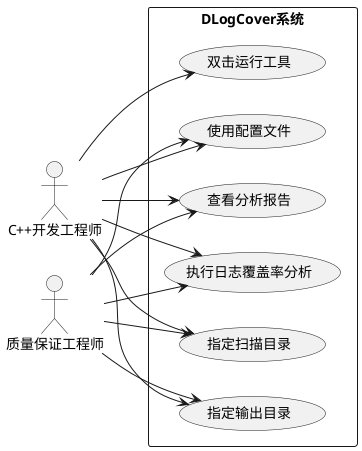
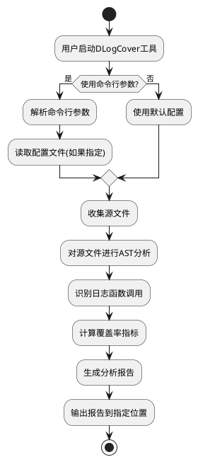
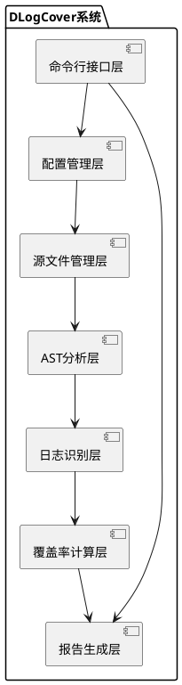
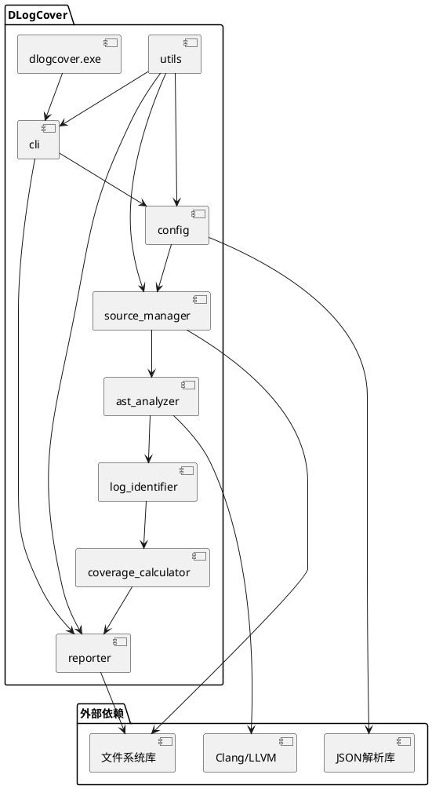
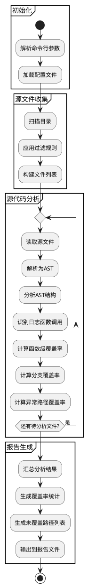
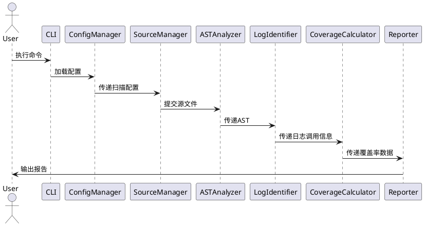
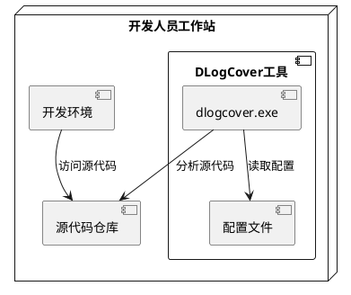

# DLogCover - C++日志覆盖率统计工具架构设计文档

## 概述

### 目的

本文档是针对DLogCover项目的架构设计文档。本文档中将给出DLogCover项目的架构需求概述、设计约束、技术选型、总体架构、部署与实施设计等内容。

本文档的适用人员为DLogCover项目的产品经理、开发人员、测试人员、项目经理以及维护人员。

### 术语说明

- **AST**：抽象语法树(Abstract Syntax Tree)，是源代码的抽象语法结构的树状表示，树上的每个节点都表示源代码中的一个结构。

- **日志覆盖率**：代码中包含日志记录的比例，用于评估代码是否在关键路径上有足够的日志记录以便于问题定位和系统监控。

- **Clang/LLVM**：一个C/C++/Objective-C编译器前端和工具链技术的集合，提供了丰富的源代码分析能力。

- **静态分析**：不需要执行程序的情况下，通过分析源代码来发现潜在问题的技术。

### 参考资料

- C++日志覆盖率统计工具产品需求文档(产品需求文档.md)
- Clang LibTooling文档：https://clang.llvm.org/docs/LibTooling.html
- Modern C++(C++17)标准：https://en.cppreference.com/w/cpp/17

## 用例视图

### 系统主要用例



### 主要用例活动流程



## 逻辑视图

### 系统总体结构

DLogCover系统从逻辑上分为以下几个主要层次：



### 核心模块职责

1. **命令行接口层**：负责处理用户输入的命令行参数，提供友好的交互界面。
2. **配置管理层**：负责读取和管理配置文件，处理扫描路径、排除规则等配置。
3. **源文件管理层**：负责收集需要分析的源文件，处理文件过滤和路径解析。
4. **AST分析层**：基于Clang/LLVM工具链，对C++源代码进行抽象语法树分析。
5. **日志识别层**：识别代码中的日志函数调用，包括Qt日志函数和自定义日志函数。
6. **覆盖率计算层**：计算各种覆盖率指标，如函数级覆盖率、分支覆盖率等。
7. **报告生成层**：将分析结果整理成易于理解的报告，提供总体覆盖率和未覆盖路径列表等信息。

## 开发视图

### 组件设计



### 技术选型

| 类别 | 技术选择 | 说明 |
|------|----------|------|
| 开发语言 | Modern C++ (C++17) | 确保代码现代化、安全性和高性能 |
| 静态分析 | Clang/LLVM LibTooling | 提供强大的C++代码分析能力 |
| 配置文件格式 | JSON | 易于人类阅读和编辑，同时也易于程序解析 |
| 命令行解析 | CLI11/Boost Program Options | 简化命令行参数处理 |
| 文件操作 | C++17 std::filesystem | 提供可移植的文件系统操作 |
| 单元测试 | GoogleTest | 业界标准的C++测试框架 |

### 目录结构

```
dlogcover/
├── CMakeLists.txt             # 主CMake配置文件
├── README.md                  # 项目说明文档
├── docs/                      # 项目文档
│   ├── 产品需求文档.md           # 产品需求文档
│   └── 架构设计文档.md         # 本架构设计文档
├── src/                       # 源代码目录
│   ├── main.cpp               # 主入口文件
│   ├── cli/                   # 命令行接口相关代码
│   ├── config/                # 配置管理相关代码
│   ├── core/                  # 核心功能代码
│   │   ├── ast_analyzer/      # AST分析相关代码
│   │   ├── log_identifier/    # 日志识别代码
│   │   └── coverage/          # 覆盖率计算代码
│   ├── source_manager/        # 源文件管理代码
│   ├── utils/                 # 工具函数
│   └── reporter/              # 报告生成相关代码
├── include/                   # 头文件目录
│   └── dlogcover/             # 公共头文件
├── tests/                     # 测试代码
│   ├── unit/                  # 单元测试
│   └── integration/           # 集成测试
├── examples/                  # 示例代码
│   └── ...
└── third_party/               # 第三方依赖
    └── ...
```

## 过程视图

### 系统过程



### 核心对象协作图



### 接口设计

#### 命令行接口

```
dlogcover [选项]

选项:
  -h, --help                 显示帮助信息
  -d, --directory <path>     指定扫描目录 (默认: ./)
  -o, --output <path>        指定输出报告路径 (默认: ./dlogcover_report_<timestamp>.txt)
  -c, --config <path>        指定配置文件路径 (默认: ./dlogcover.json)
  -e, --exclude <pattern>    排除符合模式的文件或目录 (可多次使用)
  -l, --log-level <level>    指定最低日志级别进行过滤
  -f, --format <format>      指定报告格式 (text, json)
```

#### 配置文件格式

```json
{
  "scan": {
    "directories": ["./"],
    "excludes": ["build/", "test/"],
    "file_types": [".cpp", ".cc", ".cxx", ".h", ".hpp"]
  },
  "log_functions": {
    "qt": {
      "enabled": true,
      "functions": ["qDebug", "qInfo", "qWarning", "qCritical", "qFatal"],
      "category_functions": ["qCDebug", "qCInfo", "qCWarning", "qCCritical"]
    },
    "custom": {
      "enabled": true,
      "functions": {
        "debug": ["fmDebug"],
        "info": ["fmInfo"],
        "warning": ["fmWarning"],
        "critical": ["fmCritical"]
      }
    }
  },
  "analysis": {
    "function_coverage": true,
    "branch_coverage": true,
    "exception_coverage": true,
    "key_path_coverage": true
  },
  "report": {
    "format": "text",
    "timestamp_format": "YYYYMMDD_HHMMSS"
  }
}
```

### 性能设计

为确保满足性能要求，DLogCover采用以下设计策略：

1. **增量分析**：对于大型项目，支持增量分析，只分析修改过的文件。
2. **并行处理**：利用多线程并行处理多个源文件，提高分析速度。
3. **内存优化**：采用流式处理大文件，避免一次性加载全部内容到内存。
4. **分析缓存**：缓存分析结果，避免重复分析相同的文件。
5. **AST优化**：只构建和分析必要的AST节点，减少内存占用。

### 可用性设计

1. **错误恢复**：在分析过程中遇到错误时，能够跳过当前文件继续分析其他文件。
2. **进度显示**：在分析大型项目时，显示进度条，提供估计完成时间。
3. **详细日志**：提供详细的日志输出，帮助用户了解分析过程和结果。
4. **帮助信息**：提供丰富的命令行帮助信息和错误提示。
5. **交互式报告**：生成易于阅读和导航的分析报告。

## 物理视图

### 部署结构

由于DLogCover是一个单机运行的命令行工具，部署结构相对简单：



## 架构演进计划

### 当前架构限制

1. 初始版本仅支持本地文件系统分析，不支持远程代码分析。
2. 暂不支持增量分析，对大型项目分析效率有限。
3. 仅提供命令行界面，缺乏图形化展示。

### 未来演进方向

1. **第二阶段 (v2.0)**
   - 增加增量分析支持，提高大型项目分析效率
   - 添加HTML格式报告，提供可视化分析结果
   - 支持自定义日志函数模式匹配

2. **第三阶段 (v3.0)**
   - 开发图形用户界面，提供更友好的用户体验
   - 添加CI/CD集成支持，自动化日志覆盖率检查
   - 支持团队协作和历史数据比较

3. **长期规划**
   - 提供基于Web的分析服务，支持远程代码分析
   - 增加智能建议功能，基于代码结构自动推荐日志位置
   - 集成到主流IDE中，提供实时日志覆盖率分析

## 变更记录

### V1.0.0
- 初始版本
- 基于产品需求文档.md创建架构设计文档
- 定义系统总体结构和主要组件
- 规划技术选型和性能优化策略 