# DLogCover - C++日志覆盖率统计工具概要设计文档

## 概述

### 目的

本文档是针对DLogCover系统给出的系统概要设计文档，在本文档中，将给出DLogCover系统的系统设计原则、关键静态结构设计、关键动态流程设计、数据结构设计、非功能性设计、系统部署与实施设计等内容。

DLogCover系统的系统设计与实现基于DLogCover系统的需求分析，总体上将结合形式化设计的方法与文字描述，给出半形式化的概要设计与低层设计，与需求分析内容的相对应，以保证系统设计的严谨性与可实现性。在形式化部分，本文档将主要采取UML语言的包图、类图、序列图等进行系统设计。

本文档的适用读者为DLogCover系统的产品经理、设计人员、开发人员、测试人员以及后续维护人员。

### 术语说明

- **AST**：抽象语法树(Abstract Syntax Tree)，是源代码的抽象语法结构的树状表示，树上的每个节点都表示源代码中的一个结构。

- **日志覆盖率**：代码中包含日志记录的比例，用于评估代码是否在关键路径上有足够的日志记录以便于问题定位和系统监控。

- **Clang/LLVM**：一个C/C++/Objective-C编译器前端和工具链技术的集合，提供了丰富的源代码分析能力。

- **LibTooling**：Clang提供的一个库，允许开发者编写独立的工具来分析C++源代码。

- **函数级日志覆盖率**：在函数级别评估日志记录的覆盖情况，即有多少函数包含了日志记录。

- **分支路径日志覆盖率**：在代码分支级别评估日志记录的覆盖情况，即有多少代码分支（if-else、switch-case等）包含了日志记录。

- **异常处理路径日志覆盖率**：在异常处理路径（try-catch块）级别评估日志记录的覆盖情况。

### 参考资料

- DLogCover产品需求文档 (产品需求文档.md)
- Clang LibTooling文档：https://clang.llvm.org/docs/LibTooling.html
- Modern C++(C++17)标准：https://en.cppreference.com/w/cpp/17
- Google C++ Style Guide：https://google.github.io/styleguide/cppguide.html

## 系统设计

### 设计原则

DLogCover系统在设计时主要考虑以下原则：

1. **模块化原则**：系统分为命令行接口、配置管理、源文件管理、AST分析、日志识别、覆盖率计算和报告生成等模块，各模块职责明确，接口清晰。

2. **可扩展性原则**：系统设计支持扩展新的日志函数类型识别、覆盖率计算方法和报告格式，方便未来功能扩展。

3. **性能优化原则**：考虑到大型项目的分析需求，系统采用流式处理和多线程设计，确保在分析大型项目时保持高效。

4. **用户友好原则**：提供清晰的命令行接口和详细的错误提示，方便用户使用和理解。

5. **技术选型原则**：使用Modern C++(C++17)作为实现语言，利用Clang/LLVM LibTooling进行AST分析，JSON格式作为配置文件格式。

### 主要模块设计

#### 结构设计

DLogCover系统的主要模块结构如下图所示：

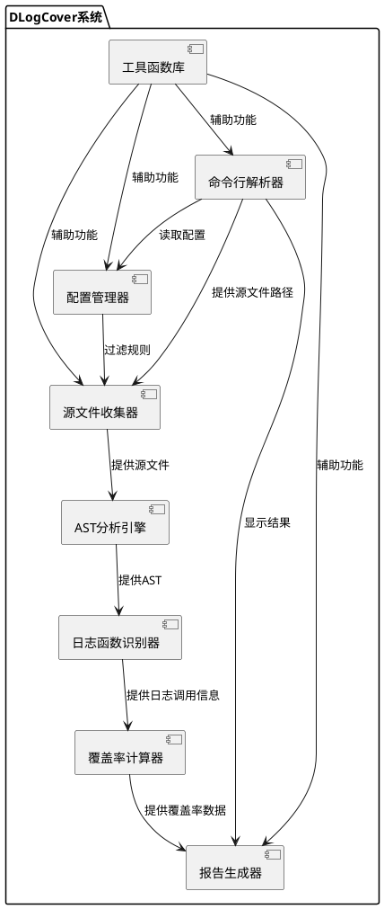

#### 命令行解析器设计

##### 模块概述

命令行解析器是DLogCover的入口模块，负责解析用户输入的命令行参数，并调用相应的模块执行功能。该模块提供友好的命令行界面，支持多种参数和选项。

##### 功能设计

- 解析命令行参数
- 显示帮助信息
- 验证参数有效性
- 调用配置管理器加载配置
- 初始化日志系统
- 调用报告生成器显示分析结果

模块类图：

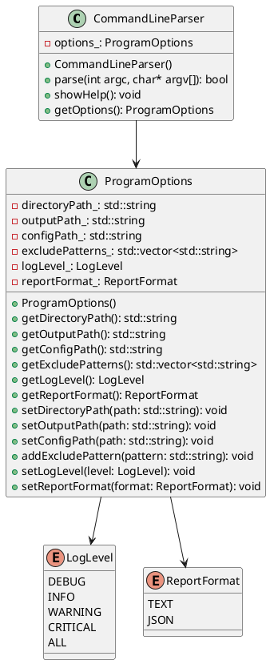

#### 配置管理器设计

##### 模块概述

配置管理器负责读取和管理配置文件，处理扫描路径、排除规则、日志函数配置等设置。该模块支持JSON格式的配置文件，并提供默认配置。

##### 功能设计

- 读取JSON格式配置文件
- 提供默认配置值
- 验证配置有效性
- 合并命令行参数和配置文件

模块类图：

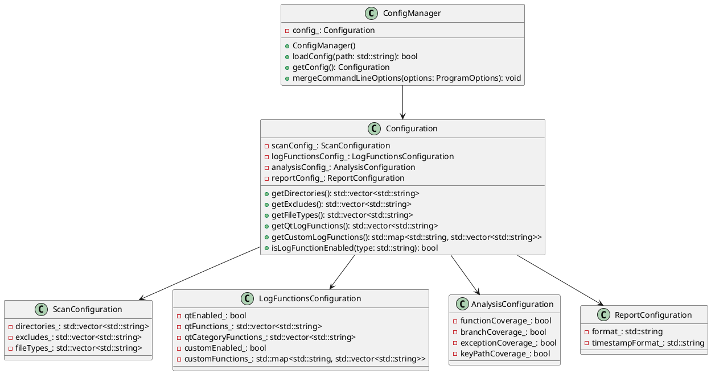

#### 源文件收集器设计

##### 模块概述

源文件收集器负责根据配置收集需要分析的源文件，处理文件过滤和路径解析。该模块支持扫描目录、应用过滤规则和构建文件列表。

##### 功能设计

- 扫描指定目录
- 应用文件类型过滤
- 应用排除规则过滤
- 构建源文件列表

模块类图：

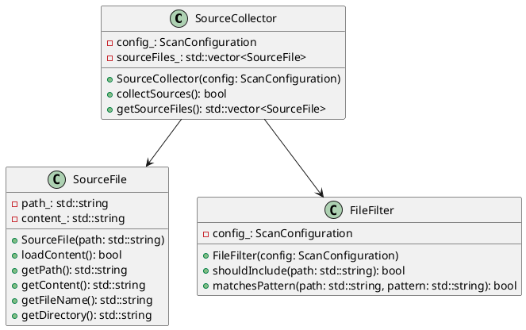

#### AST分析引擎设计

##### 模块概述

AST分析引擎基于Clang/LLVM工具链，负责解析C++源代码，生成抽象语法树，并识别代码中的函数、条件分支、异常处理等结构。

##### 功能设计

- 解析C++源代码
- 生成抽象语法树
- 识别函数定义
- 识别条件分支
- 识别异常处理路径
- 提供AST节点访问接口

模块类图：

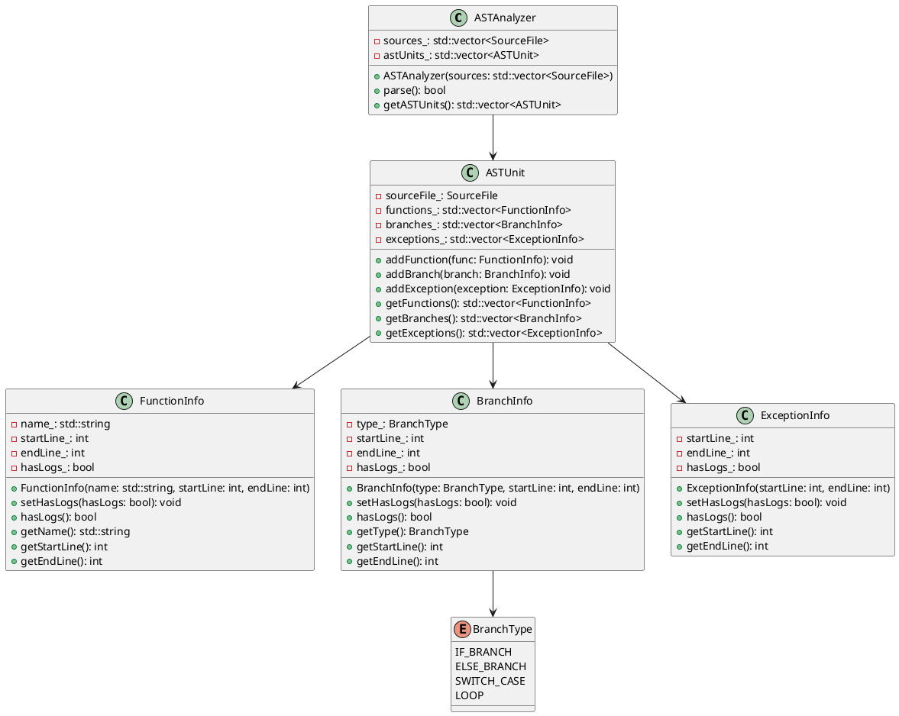

#### 日志函数识别器设计

##### 模块概述

日志函数识别器负责识别代码中的日志函数调用，包括Qt日志函数、分类日志函数和自定义日志函数。

##### 功能设计

- 识别Qt基础日志函数
- 识别Qt分类日志函数
- 识别自定义日志函数
- 记录日志函数调用位置
- 关联日志函数调用与代码结构

模块类图：

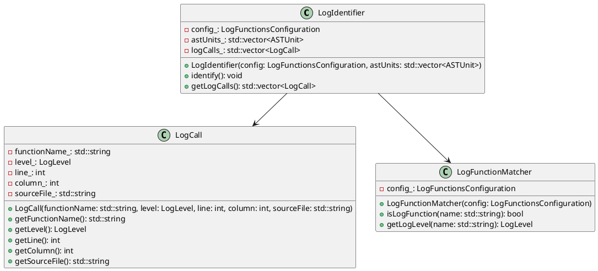

#### 覆盖率计算器设计

##### 模块概述

覆盖率计算器基于AST分析和日志分析的结果，计算各种覆盖率指标，如函数级覆盖率、分支覆盖率等。

##### 功能设计

- 计算函数级日志覆盖率
- 计算分支路径日志覆盖率
- 计算异常处理路径日志覆盖率
- 计算关键代码路径日志覆盖率
- 分析日志级别分布

模块类图：

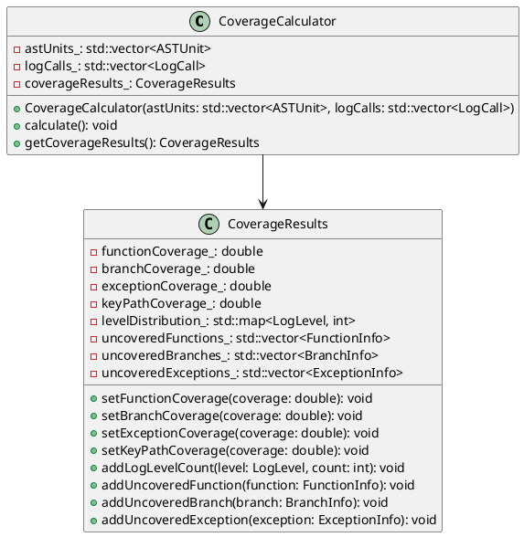

#### 报告生成器设计

##### 模块概述

报告生成器负责将分析结果整理成易于理解的报告，提供总体覆盖率和未覆盖路径列表等信息。

##### 功能设计

- 生成文本格式报告
- 生成JSON格式报告
- 提供总体覆盖率统计
- 提供文件级别统计
- 提供未覆盖路径列表
- 提供日志使用建议

模块类图：

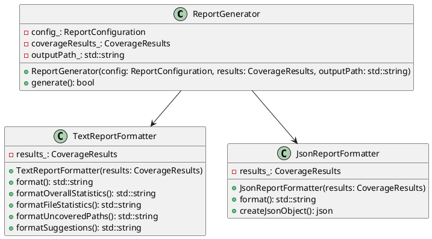

### 关键流程设计

#### 命令行分析流程

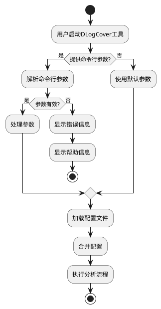

#### 源代码分析流程

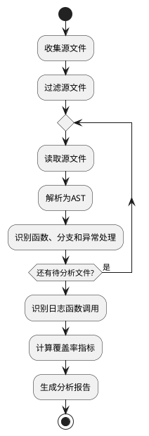

#### 核心对象协作图

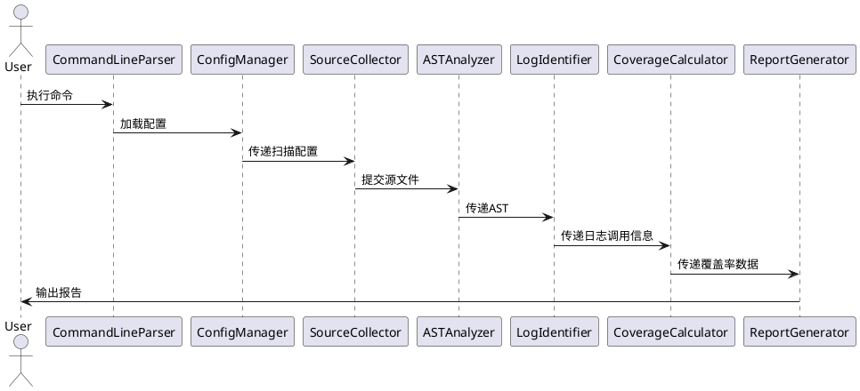

### 关键数据结构设计

#### 配置文件格式

```json
{
  "scan": {
    "directories": ["./"],
    "excludes": ["build/", "test/"],
    "file_types": [".cpp", ".cc", ".cxx", ".h", ".hpp"]
  },
  "log_functions": {
    "qt": {
      "enabled": true,
      "functions": ["qDebug", "qInfo", "qWarning", "qCritical", "qFatal"],
      "category_functions": ["qCDebug", "qCInfo", "qCWarning", "qCCritical"]
    },
    "custom": {
      "enabled": true,
      "functions": {
        "debug": ["fmDebug"],
        "info": ["fmInfo"],
        "warning": ["fmWarning"],
        "critical": ["fmCritical"]
      }
    }
  },
  "analysis": {
    "function_coverage": true,
    "branch_coverage": true,
    "exception_coverage": true,
    "key_path_coverage": true
  },
  "report": {
    "format": "text",
    "timestamp_format": "YYYYMMDD_HHMMSS"
  }
}
```

#### 报告格式

文本报告格式示例：

```
DLogCover 日志覆盖率分析报告
==============================
生成时间: 2023-08-01 10:00:00
扫描目录: /path/to/source
扫描文件数: 100
分析文件数: 95

覆盖率统计:
-----------
函数级日志覆盖率: 75.5% (151/200)
分支路径日志覆盖率: 60.2% (130/216)
异常处理路径日志覆盖率: 90.0% (45/50)
关键代码路径日志覆盖率: 85.7% (30/35)

日志级别分布:
-----------
DEBUG: 150 (30%)
INFO: 100 (20%)
WARNING: 180 (36%)
CRITICAL: 70 (14%)

未覆盖函数列表:
--------------
file1.cpp:10-20: void processData()
file1.cpp:30-40: int calculateSum(int* data, int size)
...

建议:
----
1. 在错误处理路径中添加适当的日志记录
2. 在关键函数入口和退出点添加日志
3. 在异常条件下使用WARNING或CRITICAL级别的日志
```

## 非功能性设计

### 性能

DLogCover工具的性能设计关注点主要包括：

1. **扫描速度优化**：
   - 采用多线程并行处理多个源文件
   - 使用流式处理大文件，避免一次性加载全部内容到内存
   - 实现增量分析，只分析修改过的文件

2. **内存占用控制**：
   - 限制每次加载的文件数量
   - 分析完成后及时释放资源
   - 只构建和分析必要的AST节点

3. **性能指标**：
   - 单文件分析时间 < 1秒
   - 100万行代码项目扫描时间 < 10分钟
   - 内存占用 < 2GB
   - CPU使用率 < 70%

### 可靠性

1. **错误处理**：
   - 对输入参数进行严格验证
   - 对文件读取错误进行处理
   - 对AST解析错误进行处理
   - 提供详细的错误日志

2. **异常恢复**：
   - 在分析单个文件失败时能够继续处理其他文件
   - 在解析配置文件失败时使用默认配置
   - 提供检查点机制，支持从中断点恢复分析

### 易用性

1. **命令行界面**：
   - 提供清晰的帮助信息
   - 支持常用的命令行参数格式
   - 提供进度显示

2. **配置文件**：
   - 使用易于理解的JSON格式
   - 提供详细的配置示例
   - 支持配置文件验证

3. **报告格式**：
   - 提供易于阅读的文本报告
   - 支持结构化的JSON报告
   - 提供清晰的日志覆盖率统计和建议

### 兼容性

1. **多平台支持**：
   - 支持Linux、macOS和Windows操作系统

2. **多语言版本支持**：
   - 支持C++11/14/17/20

3. **多构建系统支持**：
   - 支持CMake、Make等构建系统

## 部署与实施

### 部署结构

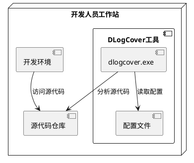

### 部署要求

1. **系统要求**：
   - 操作系统：Linux、macOS或Windows
   - 内存：至少4GB
   - 磁盘空间：至少1GB

2. **依赖项**：
   - Clang/LLVM库
   - C++17兼容的编译器
   - JSON解析库
   - 文件系统库

3. **安装步骤**：
   - 从源代码编译或下载预编译二进制文件
   - 安装必要的依赖项
   - 配置环境变量
   - 创建配置文件

## 变更记录

### V1.0.0
- 初始版本
- 基于DLogCover产品需求文档创建概要设计文档
- 定义系统总体结构和主要模块
- 设计核心流程和关键数据结构 