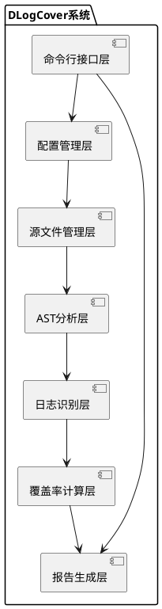
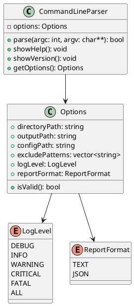
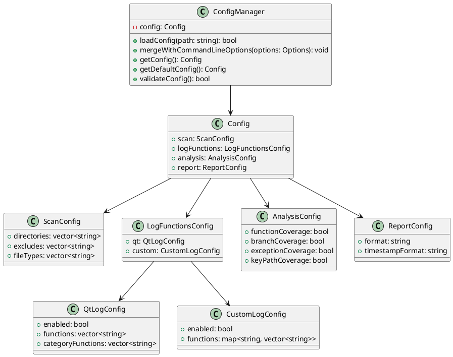
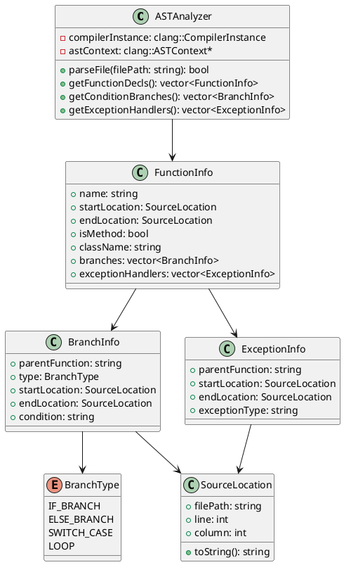
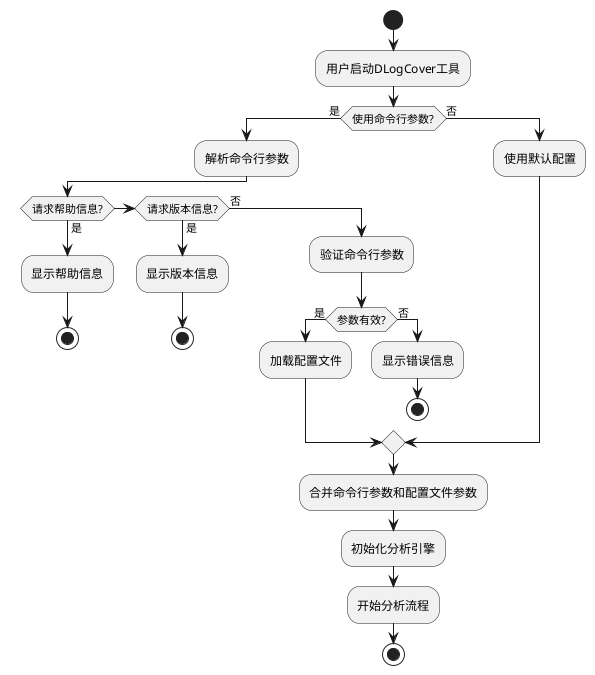
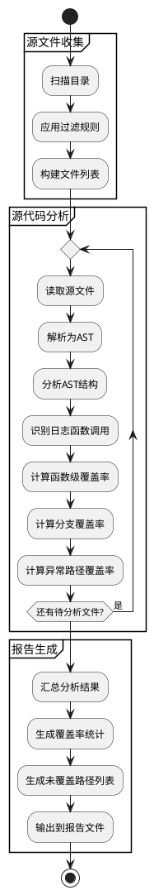
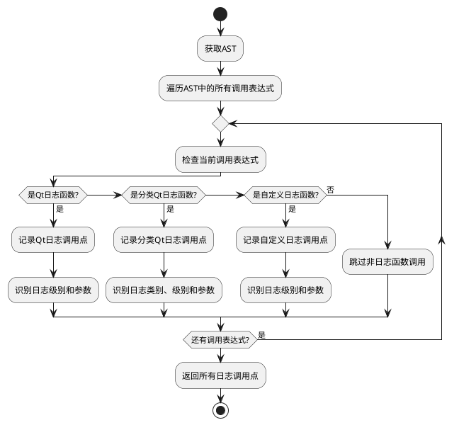
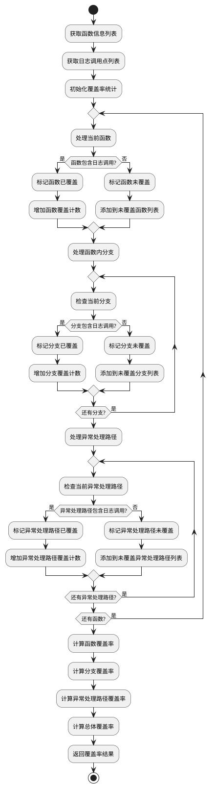
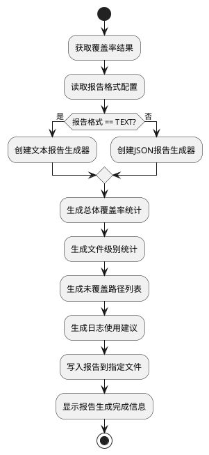
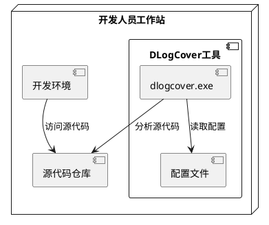

# DLogCover - C++日志覆盖率统计工具概要设计文档

## 概述

### 目的

本文档是针对DLogCover系统给出的系统概要设计文档，在本文档中，将给出DLogCover系统的系统设计原则、关键静态结构设计、关键动态流程设计、数据结构设计、人机交互设计、非功能性设计、系统部署与实施设计等内容。

DLogCover系统的系统设计与实现基于DLogCover系统的需求分析，总体上将结合形式化设计的方法与文字描述，给出半形式化的概要设计与低层设计，与需求分析内容的相对应，以保证系统设计的严谨性与可实现性。在形式化部分，本文档将主要采取UML语言的包图、类图、序列图等进行系统设计。

本文档的适用读者为DLogCover系统的产品经理、设计人员、开发人员、测试人员以及后续维护人员。

### 术语说明

- **AST**：抽象语法树(Abstract Syntax Tree)，是源代码的抽象语法结构的树状表示，树上的每个节点都表示源代码中的一个结构。

- **日志覆盖率**：代码中包含日志记录的比例，用于评估代码是否在关键路径上有足够的日志记录以便于问题定位和系统监控。

- **Clang/LLVM**：一个C/C++/Objective-C编译器前端和工具链技术的集合，提供了丰富的源代码分析能力。

- **静态分析**：不需要执行程序的情况下，通过分析源代码来发现潜在问题的技术。

- **Qt日志**：Qt框架提供的日志系统，包括qDebug、qInfo、qWarning、qCritical和qFatal等级别的日志函数。

### 参考资料

- C++日志覆盖率统计工具产品需求文档(产品需求文档.md)
- C++日志覆盖率统计工具架构设计文档(架构设计文档.md)
- Clang LibTooling文档：https://clang.llvm.org/docs/LibTooling.html
- Modern C++(C++17)标准：https://en.cppreference.com/w/cpp/17

## 系统设计

### 设计原则

DLogCover系统设计时主要考虑以下几个方面的问题：

1. **性能效率**：分析大型C++项目时需要保证足够的性能，支持单文件分析时间小于1秒，100万行代码项目扫描时间小于10分钟。

2. **可扩展性**：支持自定义日志函数的识别，便于在不同项目中进行定制化分析。

3. **易用性**：提供简单明了的命令行接口，支持默认配置，使用户可以快速上手。

4. **准确性**：准确识别代码中的日志调用点，并正确计算日志覆盖率指标。

5. **资源占用**：控制内存占用（<2GB）和CPU使用率（<70%），避免影响开发环境的其他应用。

技术选型上，选择Modern C++(C++17)作为开发语言，利用Clang/LLVM工具链进行AST分析，确保静态分析的准确性和效率。

### 主要模块设计

#### 结构设计

DLogCover系统的整体结构采用分层架构，主要分为以下几个层次：



各层次的主要职责：

1. **命令行接口层**：负责处理用户输入的命令行参数，提供友好的交互界面。该层是用户与系统交互的入口点，需要实现参数解析、帮助信息显示等功能。

2. **配置管理层**：负责读取和管理配置文件，处理扫描路径、排除规则等配置。该层将用户的配置信息组织成结构化数据，供其他模块使用。

3. **源文件管理层**：负责收集需要分析的源文件，处理文件过滤和路径解析。该层需要遍历目录，识别C++源文件，并根据配置进行过滤。

4. **AST分析层**：基于Clang/LLVM工具链，对C++源代码进行抽象语法树分析。该层是系统的核心，负责解析C++代码并生成AST。

5. **日志识别层**：识别代码中的日志函数调用，包括Qt日志函数和自定义日志函数。该层需要在AST中查找日志函数调用点，并对调用点进行标记。

6. **覆盖率计算层**：计算各种覆盖率指标，如函数级覆盖率、分支覆盖率等。该层基于日志识别的结果，统计各种覆盖率指标。

7. **报告生成层**：将分析结果整理成易于理解的报告，提供总体覆盖率和未覆盖路径列表等信息。该层是系统的输出点，负责生成最终的分析报告。

#### 命令行接口模块设计

##### 模块概述

命令行接口模块是DLogCover工具的入口点，负责解析用户输入的命令行参数，并根据参数启动相应的功能。该模块提供了一组命令行选项，使用户可以灵活地配置分析过程。

##### 功能设计

命令行接口模块主要提供以下功能：
- 解析命令行参数
- 显示帮助信息
- 加载配置文件
- 启动分析流程
- 控制输出报告的生成

模块类图：



##### 结构设计

命令行接口模块由CommandLineParser和Options两个主要类组成。CommandLineParser负责解析命令行参数，Options存储解析后的参数值。此外，还定义了LogLevel和ReportFormat两个枚举类型，用于表示日志级别和报告格式。

##### 接口设计

CommandLineParser类提供以下主要接口：
- `parse(argc: int, argv: char**): bool` - 解析命令行参数
- `showHelp(): void` - 显示帮助信息
- `showVersion(): void` - 显示版本信息
- `getOptions(): Options` - 获取解析后的选项

Options类提供以下主要接口：
- `isValid(): bool` - 验证选项是否有效

#### 配置管理模块设计

##### 模块概述

配置管理模块负责读取和管理配置文件，将配置文件中的参数解析为系统可用的结构化数据。该模块支持JSON格式的配置文件，允许用户配置扫描路径、排除规则、日志函数识别规则等参数。

##### 功能设计

配置管理模块主要提供以下功能：
- 读取JSON格式的配置文件
- 解析配置文件内容
- 合并命令行参数和配置文件参数
- 提供默认配置
- 验证配置的有效性

模块类图：



##### 结构设计

配置管理模块由ConfigManager和一系列配置类组成。ConfigManager负责加载和管理配置，Config是配置的根类，包含ScanConfig、LogFunctionsConfig、AnalysisConfig和ReportConfig四个子配置类。

##### 接口设计

ConfigManager类提供以下主要接口：
- `loadConfig(path: string): bool` - 加载配置文件
- `mergeWithCommandLineOptions(options: Options): void` - 合并命令行参数和配置文件参数
- `getConfig(): Config` - 获取当前配置
- `getDefaultConfig(): Config` - 获取默认配置
- `validateConfig(): bool` - 验证配置的有效性

#### AST分析模块设计

##### 模块概述

AST分析模块是DLogCover工具的核心模块，负责解析C++源代码并生成抽象语法树(AST)。该模块基于Clang/LLVM工具链，实现了对C++代码的静态分析能力。通过分析AST，该模块可以识别代码中的函数、条件分支、异常处理等结构。

##### 功能设计

AST分析模块主要提供以下功能：
- 解析C++源文件
- 生成抽象语法树
- 识别代码中的函数定义
- 识别条件分支和异常处理路径
- 提供AST遍历接口

模块类图：



##### 结构设计

AST分析模块由ASTAnalyzer和一系列信息类组成。ASTAnalyzer负责解析源文件和生成AST，FunctionInfo、BranchInfo和ExceptionInfo用于存储从AST中提取的信息。

##### 接口设计

ASTAnalyzer类提供以下主要接口：
- `parseFile(filePath: string): bool` - 解析源文件并生成AST
- `getFunctionDecls(): vector<FunctionInfo>` - 获取函数声明信息
- `getConditionBranches(): vector<BranchInfo>` - 获取条件分支信息
- `getExceptionHandlers(): vector<ExceptionInfo>` - 获取异常处理信息

### 关键流程设计

#### 工具启动与参数解析流程



#### 源文件分析流程



#### 日志函数识别流程



#### 覆盖率计算流程



#### 报告生成流程



### 关键数据结构设计

#### 配置文件结构

配置文件采用JSON格式，主要包含以下几个部分：

```json
{
  "scan": {
    "directories": ["./"],
    "excludes": ["build/", "test/"],
    "file_types": [".cpp", ".cc", ".cxx", ".h", ".hpp"]
  },
  "log_functions": {
    "qt": {
      "enabled": true,
      "functions": ["qDebug", "qInfo", "qWarning", "qCritical", "qFatal"],
      "category_functions": ["qCDebug", "qCInfo", "qCWarning", "qCCritical"]
    },
    "custom": {
      "enabled": true,
      "functions": {
        "debug": ["fmDebug"],
        "info": ["fmInfo"],
        "warning": ["fmWarning"],
        "critical": ["fmCritical"]
      }
    }
  },
  "analysis": {
    "function_coverage": true,
    "branch_coverage": true,
    "exception_coverage": true,
    "key_path_coverage": true
  },
  "report": {
    "format": "text",
    "timestamp_format": "YYYYMMDD_HHMMSS"
  }
}
```

#### 日志调用点结构

```cpp
struct LogCallSite {
    std::string functionName;     // 日志函数名称
    LogLevel level;               // 日志级别
    std::string category;         // 日志分类（对于分类日志）
    SourceLocation location;      // 调用位置
    std::string containingFunction; // 包含该调用的函数
    std::string containingClass;    // 包含该调用的类（如果有）
    bool isInBranch;              // 是否在分支内
    bool isInException;           // 是否在异常处理内
    std::string message;          // 日志消息（如果可提取）
};
```

#### 覆盖率结果结构

```cpp
struct CoverageResult {
    // 函数覆盖率
    int totalFunctions;
    int coveredFunctions;
    double functionCoverageRate;
    std::vector<FunctionInfo> uncoveredFunctions;
    
    // 分支覆盖率
    int totalBranches;
    int coveredBranches;
    double branchCoverageRate;
    std::vector<BranchInfo> uncoveredBranches;
    
    // 异常处理覆盖率
    int totalExceptionHandlers;
    int coveredExceptionHandlers;
    double exceptionCoverageRate;
    std::vector<ExceptionInfo> uncoveredExceptionHandlers;
    
    // 文件级覆盖率
    std::map<std::string, FileCoverage> fileCoverages;
    
    // 日志级别统计
    std::map<LogLevel, int> logLevelCounts;
    
    // 总体覆盖率
    double overallCoverageRate;
};

struct FileCoverage {
    std::string filePath;
    int totalFunctions;
    int coveredFunctions;
    double functionCoverageRate;
    int totalBranches;
    int coveredBranches;
    double branchCoverageRate;
    int totalExceptionHandlers;
    int coveredExceptionHandlers;
    double exceptionCoverageRate;
    double overallCoverageRate;
};
```

## 非功能性设计

### 安全性

DLogCover作为一个静态代码分析工具，不会修改用户的源代码，只进行读取操作，因此不存在对用户代码的安全风险。为了增强安全性，系统做了以下设计：

1. **文件访问限制**：DLogCover只读取指定目录下的C++源文件，不会访问系统的其他目录。

2. **输入验证**：对命令行参数和配置文件进行严格验证，防止恶意输入导致的安全问题。

3. **错误处理**：设计了完善的错误处理机制，确保在遇到异常情况时能够优雅地退出，不会导致系统资源泄露。

4. **最小权限原则**：程序运行时不需要管理员权限，遵循最小权限原则。

### 性能

为了满足产品需求中的性能要求（单文件分析时间<1秒，100万行代码项目扫描时间<10分钟），DLogCover采用了以下性能优化策略：

1. **增量分析**：对于大型项目，支持增量分析，只分析修改过的文件。

2. **并行处理**：利用多线程并行处理多个源文件，提高分析速度。

3. **内存优化**：采用流式处理大文件，避免一次性加载全部内容到内存。

4. **分析缓存**：缓存分析结果，避免重复分析相同的文件。

5. **AST优化**：只构建和分析必要的AST节点，减少内存占用。

6. **高效数据结构**：选择适合快速查找和统计的数据结构，如哈希表和平衡树。

### 可靠性

为确保DLogCover的可靠运行，系统设计了以下可靠性措施：

1. **异常处理**：对所有可能发生异常的操作进行异常捕获，确保程序不会因为异常而崩溃。

2. **错误恢复**：在分析过程中遇到错误时能够跳过当前文件继续分析其他文件，不影响整体分析过程。

3. **资源管理**：采用RAII原则管理资源，确保在异常情况下资源能够正确释放。

4. **边界检查**：对所有输入数据进行边界检查，防止缓冲区溢出等问题。

5. **单元测试**：为关键模块编写全面的单元测试，确保功能的正确性。

### 易用性

DLogCover的易用性设计主要体现在以下几个方面：

1. **简洁的命令行接口**：提供简单易用的命令行接口，支持常用的参数选项。

2. **默认配置**：提供合理的默认配置，使用户在大多数情况下无需额外配置即可使用。

3. **详细的帮助信息**：提供详细的命令行帮助信息，帮助用户理解各种参数的含义。

4. **直观的错误提示**：当输入参数有误时，提供直观的错误提示，帮助用户快速定位问题。

5. **友好的报告格式**：生成易于阅读和理解的分析报告，包含丰富的统计信息和可视化内容。

### 可用性

虽然DLogCover主要是一个命令行工具，但是设计了以下措施来提高其可用性：

1. **进度显示**：在分析大型项目时，显示进度条，提供估计完成时间。

2. **详细日志**：提供详细的日志输出，帮助用户了解分析过程和结果。

3. **可中断操作**：支持用户在长时间运行时通过Ctrl+C中断操作，优雅地终止程序。

4. **批处理支持**：支持在批处理脚本中使用，便于集成到持续集成环境中。

5. **多平台支持**：支持在Windows、Linux和macOS等多个平台上运行。

### 兼容性

DLogCover的兼容性设计主要体现在以下几个方面：

1. **多版本C++支持**：支持C++11/14/17/20等多个C++标准版本的代码分析。

2. **多种日志库支持**：除了Qt日志库外，还支持自定义日志函数的识别。

3. **编译器兼容性**：基于Clang/LLVM工具链，兼容主流C++编译器生成的代码。

4. **跨平台支持**：使用跨平台的C++17标准库，确保在不同操作系统上的兼容性。

5. **配置文件版本兼容性**：保证新版本的配置文件能够兼容旧版本。

## 部署与实施

### 部署结构

DLogCover是一个单机运行的命令行工具，部署结构相对简单：



### 部署组件

DLogCover部署包含以下主要组件：

1. **可执行文件**：dlogcover或dlogcover.exe（Windows平台）
2. **配置文件模板**：dlogcover.json.template
3. **使用说明文档**：README.md和用户手册
4. **示例项目**：用于演示DLogCover功能的示例C++项目

### 依赖关系

DLogCover依赖以下外部组件：

1. **Clang/LLVM库**：用于C++代码的解析和AST生成
2. **JSON解析库**：用于解析配置文件
3. **C++标准库**：提供基础数据结构和算法
4. **文件系统库**：用于文件操作和目录遍历

### 安装步骤

1. 下载DLogCover发布包
2. 解压到任意目录
3. 将DLogCover可执行文件所在目录添加到PATH环境变量
4. 复制配置文件模板到工作目录并根据需要修改

### 验证安装

安装完成后，可以通过以下步骤验证安装是否成功：

1. 打开命令行终端
2. 执行命令：`dlogcover --version`，应显示版本信息
3. 执行命令：`dlogcover --help`，应显示帮助信息
4. 使用示例项目进行测试：`dlogcover -d ./example`

## 附录

### 命令行参数说明

```
dlogcover [选项]

选项:
  -h, --help                 显示帮助信息
  -d, --directory <path>     指定扫描目录 (默认: ./)
  -o, --output <path>        指定输出报告路径 (默认: ./dlogcover_report_<timestamp>.txt)
  -c, --config <path>        指定配置文件路径 (默认: ./dlogcover.json)
  -e, --exclude <pattern>    排除符合模式的文件或目录 (可多次使用)
  -l, --log-level <level>    指定最低日志级别进行过滤
  -f, --format <format>      指定报告格式 (text, json)
```

### 配置文件格式说明

详见系统设计章节的"配置文件结构"部分。

### 错误代码列表

| 错误代码 | 错误描述 | 解决方案 |
|----------|----------|----------|
| E001 | 无效的命令行参数 | 检查命令行参数格式是否正确 |
| E002 | 配置文件不存在或格式错误 | 检查配置文件路径和内容 |
| E003 | 扫描目录不存在 | 检查指定的扫描目录是否存在 |
| E004 | 无法创建输出文件 | 检查输出路径权限和磁盘空间 |
| E005 | 源文件解析错误 | 检查源文件语法是否正确 |
| E006 | 内存不足 | 减少扫描文件数量或增加系统内存 |
| E007 | Clang库初始化失败 | 检查Clang库是否正确安装 |

## 变更记录

### V1.0.0
- 初始版本
- 基于产品需求文档.md和架构设计文档.md创建概要设计文档
- 定义系统设计原则和主要模块
- 详细描述关键流程和数据结构
- 规划非功能性设计和部署方案 