# DLogCover - C++日志覆盖率统计工具详细设计文档

## 概述

### 目的

本文档是针对DLogCover系统给出的系统详细设计文档，在本文档中，将给出DLogCover系统的系统设计原则、关键静态结构设计、关键动态流程设计、数据结构设计、人机交互设计、非功能性设计、系统部署与实施设计、版本维护设计等内容。

DLogCover系统的系统设计与实现基于DLogCover系统的需求分析，总体上将结合形式化设计的方法与文字描述，给出半形式化的概要设计与低层设计，与需求分析内容的相对应，以保证系统设计的严谨性与可实现性。在形式化部分，本文档将主要采取UML语言的包图、类图、序列图等进行系统设计。

本文档的适用读者为DLogCover系统的产品经理、设计人员、开发人员、测试人员以及后续维护人员。

### 术语说明

- **AST**：抽象语法树(Abstract Syntax Tree)，是源代码的抽象语法结构的树状表示，树上的每个节点都表示源代码中的一个结构。

- **日志覆盖率**：代码中包含日志记录的比例，用于评估代码是否在关键路径上有足够的日志记录以便于问题定位和系统监控。

- **Clang/LLVM**：一个C/C++/Objective-C编译器前端和工具链技术的集合，提供了丰富的源代码分析能力。

- **静态分析**：不需要执行程序的情况下，通过分析源代码来发现潜在问题的技术。

- **Qt日志**：Qt框架提供的日志系统，包括qDebug、qInfo、qWarning、qCritical和qFatal等级别的日志函数。

- **分支覆盖率**：代码中的条件分支（如if语句、switch语句等）包含日志记录的比例。

- **异常覆盖率**：代码中的异常处理路径（如try-catch块）包含日志记录的比例。

- **LibTooling**：Clang提供的工具库，用于构建基于Clang的代码分析工具。

- **CLI**：Command Line Interface，命令行接口，用户通过终端输入命令与程序交互的方式。

### 参考资料

- C++日志覆盖率统计工具产品需求文档(产品需求文档.md)
- C++日志覆盖率统计工具架构设计文档(架构设计文档.md)
- C++日志覆盖率统计工具概要设计文档(概要设计文档.md)
- Clang LibTooling文档：https://clang.llvm.org/docs/LibTooling.html
- Modern C++(C++17)标准：https://en.cppreference.com/w/cpp/17
- Qt日志系统文档：https://doc.qt.io/qt-5/qtglobal.html#qDebug
- JSON for Modern C++库：https://github.com/nlohmann/json

## 模块设计

### 设计约束

DLogCover系统在开发实现过程中需要遵循以下设计约束：

1. **编程语言与标准**：
   - 使用Modern C++（C++17标准）进行开发
   - 遵循Google C++代码风格指南
   - 使用驼峰式命名法
   - 类名以大写字母开头
   - 函数名和变量名以小写字母开头
   - 常量使用全大写和下划线分隔

2. **源码目录结构**：
   ```
   dlogcover/
   ├── CMakeLists.txt            # 主CMake配置文件
   ├── src/                      # 源代码目录
   │   ├── main.cpp              # 主入口文件
   │   ├── cli/                  # 命令行接口相关代码
   │   ├── config/               # 配置管理相关代码
   │   ├── core/                 # 核心功能代码
   │   │   ├── ast_analyzer/     # AST分析相关代码
   │   │   ├── log_identifier/   # 日志识别代码
   │   │   └── coverage/         # 覆盖率计算代码
   │   ├── source_manager/       # 源文件管理代码
   │   ├── utils/                # 工具函数
   │   └── reporter/             # 报告生成相关代码
   ├── include/                  # 头文件目录
   │   └── dlogcover/            # 公共头文件
   ├── tests/                    # 测试代码
   │   ├── unit/                 # 单元测试
   │   └── integration/          # 集成测试
   └── third_party/              # 第三方依赖
   ```

3. **编码规则**：
   - 每个源码文件顶部包含项目版权声明和开源许可证信息
   - 每个类和函数必须有文档注释，使用Doxygen风格
   - 严格进行错误处理，确保所有异常都被捕获处理
   - 代码中不应有硬编码的魔法数字，应使用有意义的常量
   - 代码行长度不超过100个字符
   - 使用空格代替制表符进行缩进，每级缩进为2个空格

4. **构建工具**：
   - 使用CMake作为构建系统
   - 支持跨平台构建（Linux、Windows、macOS）
   - 不同模块分别构建为独立的静态库，然后链接成可执行文件

5. **测试要求**：
   - 所有核心功能必须编写单元测试
   - 使用GoogleTest作为测试框架
   - 单元测试覆盖率要求达到80%以上
   - 集成测试验证整个工具的功能完整性

6. **依赖管理**：
   - 尽量减少外部依赖，必要的依赖使用CMake的FetchContent或类似机制管理
   - 所有第三方依赖需要明确版本号，确保构建的可重现性

7. **版本控制**：
   - 使用Git进行版本控制
   - 遵循语义化版本规范进行版本管理（主版本号.次版本号.修订号）
   - 每次提交需要有清晰的提交信息，描述变更内容

8. **性能约束**：
   - 单文件分析时间不超过1秒
   - 100万行代码项目扫描时间不超过10分钟
   - 内存占用不超过2GB
   - CPU使用率不超过70%

### 系统模块设计

DLogCover系统的整体模块设计如下图所示：

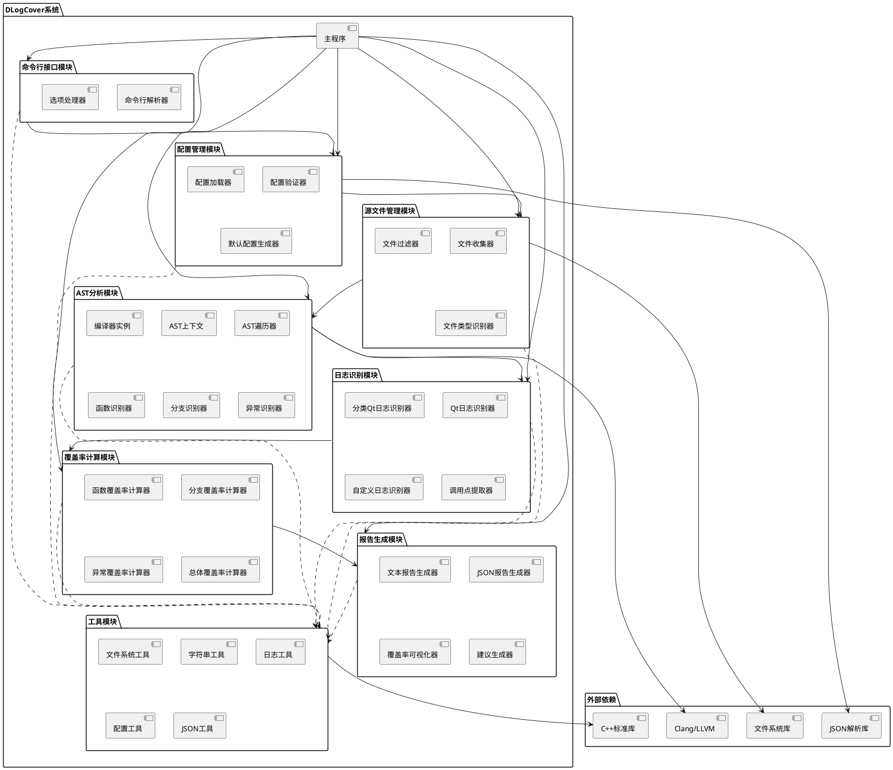

各模块的主要功能和依赖关系说明：

1. **主程序（Main）**：
   - 系统入口点，负责协调各个模块的工作
   - 依赖于所有核心模块，按照工作流程顺序调用各模块的功能

2. **命令行接口模块（CLI）**：
   - 负责解析用户输入的命令行参数，提供友好的交互界面
   - 依赖于配置管理模块，将命令行参数转换为配置信息
   - 依赖于工具模块中的字符串工具和日志工具

3. **配置管理模块（Config）**：
   - 负责读取和管理配置文件，处理扫描路径、排除规则等配置
   - 依赖于外部JSON解析库，解析JSON格式的配置文件
   - 依赖于工具模块中的配置工具和JSON工具

4. **源文件管理模块（SourceManager）**：
   - 负责收集需要分析的源文件，处理文件过滤和路径解析
   - 依赖于外部文件系统库，进行文件操作和目录遍历
   - 依赖于工具模块中的文件系统工具

5. **AST分析模块（ASTAnalyzer）**：
   - 负责解析C++源代码并生成抽象语法树，是系统的核心模块
   - 依赖于Clang/LLVM库，利用其强大的C++解析能力
   - 依赖于工具模块中的日志工具和字符串工具

6. **日志识别模块（LogIdentifier）**：
   - 负责识别代码中的日志函数调用，包括Qt日志函数和自定义日志函数
   - 依赖于AST分析模块，在AST中查找日志函数调用
   - 依赖于工具模块中的字符串工具

7. **覆盖率计算模块（CoverageCalculator）**：
   - 负责计算各种覆盖率指标，如函数级覆盖率、分支覆盖率等
   - 依赖于日志识别模块，基于日志调用点信息计算覆盖率
   - 依赖于工具模块中的配置工具

8. **报告生成模块（Reporter）**：
   - 负责将分析结果整理成易于理解的报告
   - 依赖于覆盖率计算模块，获取覆盖率数据
   - 依赖于工具模块中的文件系统工具、字符串工具和JSON工具

9. **工具模块（Utils）**：
   - 提供各种通用工具函数和类，为其他模块提供支持
   - 依赖于C++标准库，实现基础功能

10. **外部依赖**：
    - Clang/LLVM：提供C++代码解析和AST生成能力
    - JSON解析库：用于解析JSON格式的配置文件
    - 文件系统库：提供文件操作和目录遍历功能
    - C++标准库：提供基础数据结构和算法支持

### 命令行接口模块设计

#### 模块功能

命令行接口模块是DLogCover系统的入口点，负责处理用户输入的命令行参数，并根据参数启动相应的功能。该模块提供用户友好的命令行交互体验，支持丰富的参数选项，同时提供详细的帮助信息。

该模块的主要功能包括：
1. 解析命令行参数
2. 验证参数的有效性
3. 显示帮助信息和版本信息
4. 将命令行参数转换为配置信息
5. 协调其他模块的调用

#### 主要接口

命令行接口模块主要由CommandLineParser和Options两个类组成，以下是它们的主要接口：

**CommandLineParser类**

```cpp
/**
 * @class CommandLineParser
 * @brief 命令行参数解析器
 *
 * 负责解析和处理命令行参数，提供友好的用户交互
 */
class CommandLineParser {
public:
    /**
     * @brief 构造函数
     */
    CommandLineParser();

    /**
     * @brief 析构函数
     */
    ~CommandLineParser();

    /**
     * @brief 解析命令行参数
     *
     * @param argc 参数数量
     * @param argv 参数数组
     * @return bool 解析是否成功
     */
    bool parse(int argc, char** argv);

    /**
     * @brief 显示帮助信息
     */
    void showHelp() const;

    /**
     * @brief 显示版本信息
     */
    void showVersion() const;

    /**
     * @brief 获取解析后的选项
     *
     * @return const Options& 选项对象的常量引用
     */
    const Options& getOptions() const;

    /**
     * @brief 检查是否请求了帮助信息
     *
     * @return bool 是否请求了帮助信息
     */
    bool isHelpRequested() const;

    /**
     * @brief 检查是否请求了版本信息
     *
     * @return bool 是否请求了版本信息
     */
    bool isVersionRequested() const;

private:
    Options options_;                  ///< 存储解析后的选项
    bool helpRequested_;               ///< 是否请求了帮助信息
    bool versionRequested_;            ///< 是否请求了版本信息

    /**
     * @brief 初始化参数定义
     */
    void initializeOptions();

    /**
     * @brief 验证参数的有效性
     *
     * @return bool 参数是否有效
     */
    bool validateOptions();
};
```

**Options类**

```cpp
/**
 * @enum LogLevel
 * @brief 日志级别枚举
 */
enum class LogLevel {
    DEBUG,      ///< 调试级别
    INFO,       ///< 信息级别
    WARNING,    ///< 警告级别
    CRITICAL,   ///< 严重级别
    FATAL,      ///< 致命级别
    ALL         ///< 所有级别
};

/**
 * @enum ReportFormat
 * @brief 报告格式枚举
 */
enum class ReportFormat {
    TEXT,       ///< 文本格式
    JSON        ///< JSON格式
};

/**
 * @class Options
 * @brief 命令行选项
 *
 * 存储解析后的命令行参数
 */
class Options {
public:
    /**
     * @brief 构造函数
     */
    Options();

    /**
     * @brief 析构函数
     */
    ~Options();

    /**
     * @brief 验证选项是否有效
     *
     * @return bool 选项是否有效
     */
    bool isValid() const;

    // 选项属性
    std::string directoryPath;             ///< 扫描目录路径
    std::string outputPath;                ///< 输出报告路径
    std::string configPath;                ///< 配置文件路径
    std::vector<std::string> excludePatterns;  ///< 排除模式列表
    LogLevel logLevel;                     ///< 日志级别
    ReportFormat reportFormat;             ///< 报告格式
};
```

#### 逻辑流程

**CommandLineParser::parse方法流程**

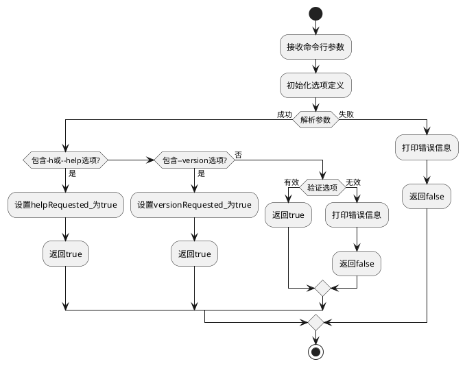

**命令行参数处理的整体流程**

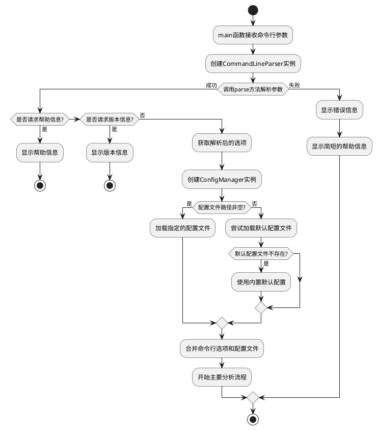

#### 错误处理

CommandLineParser类的错误处理主要体现在以下几个方面：

1. **参数解析错误**：
   - 当命令行参数格式不正确或无法识别时，parse方法会返回false
   - 将错误信息输出到标准错误流
   - 建议用户使用--help选项查看帮助信息

2. **参数验证错误**：
   - 当参数组合不合法或参数值不符合要求时，validateOptions方法会返回false
   - 具体的错误情况包括：
     - 指定的扫描目录不存在
     - 指定的配置文件不存在或格式错误
     - 输出路径所在目录不存在或无权限创建文件
     - 日志级别或报告格式值超出有效范围

3. **文件路径处理**：
   - 对路径参数进行标准化处理，解决相对路径和绝对路径混用的问题
   - 检查文件和目录是否存在，提前发现可能的错误

4. **异常情况**：
   - 通过try-catch块捕获可能的异常
   - 所有异常都被转换为用户友好的错误消息
   - 严重错误时会建议用户联系开发团队并提供错误日志

### 配置管理模块设计

#### 模块功能

配置管理模块负责读取和管理配置文件，提供默认配置，并将配置文件中的参数解析为系统可用的结构化数据。该模块支持JSON格式的配置文件，允许用户配置扫描路径、排除规则、日志函数识别规则等参数。

该模块的主要功能包括：
1. 加载和解析JSON格式的配置文件
2. 验证配置的有效性
3. 提供默认配置
4. 合并命令行参数和配置文件参数
5. 为其他模块提供配置数据

#### 主要接口

配置管理模块主要由ConfigManager类和一系列配置类组成，以下是它们的主要接口：

**ConfigManager类**

```cpp
/**
 * @class ConfigManager
 * @brief 配置管理器
 *
 * 负责加载、验证和管理配置信息
 */
class ConfigManager {
public:
    /**
     * @brief 构造函数
     */
    ConfigManager();

    /**
     * @brief 析构函数
     */
    ~ConfigManager();

    /**
     * @brief 加载配置文件
     *
     * @param path 配置文件路径
     * @return bool 加载是否成功
     */
    bool loadConfig(const std::string& path);

    /**
     * @brief 合并命令行选项和配置文件参数
     *
     * @param options 命令行选项
     */
    void mergeWithCommandLineOptions(const Options& options);

    /**
     * @brief 获取当前配置
     *
     * @return const Config& 配置对象的常量引用
     */
    const Config& getConfig() const;

    /**
     * @brief 获取默认配置
     *
     * @return Config 默认配置对象
     */
    static Config getDefaultConfig();

    /**
     * @brief 验证配置的有效性
     *
     * @return bool 配置是否有效
     */
    bool validateConfig() const;

    /**
     * @brief 保存配置到文件
     *
     * @param path 保存路径
     * @return bool 保存是否成功
     */
    bool saveConfig(const std::string& path) const;

private:
    Config config_;                    ///< 当前配置对象

    /**
     * @brief 解析JSON配置
     *
     * @param json JSON对象
     * @return bool 解析是否成功
     */
    bool parseJsonConfig(const nlohmann::json& json);

    /**
     * @brief 应用默认值到配置中的空字段
     */
    void applyDefaultValues();
};
```

**Config类及相关配置类**

```cpp
/**
 * @class ScanConfig
 * @brief 扫描配置
 */
class ScanConfig {
public:
    std::vector<std::string> directories;  ///< 扫描目录列表
    std::vector<std::string> excludes;     ///< 排除模式列表
    std::vector<std::string> fileTypes;    ///< 文件类型列表
};

/**
 * @class QtLogConfig
 * @brief Qt日志配置
 */
class QtLogConfig {
public:
    bool enabled;                           ///< 是否启用Qt日志识别
    std::vector<std::string> functions;     ///< Qt日志函数列表
    std::vector<std::string> categoryFunctions;  ///< Qt分类日志函数列表
};

/**
 * @class CustomLogConfig
 * @brief 自定义日志配置
 */
class CustomLogConfig {
public:
    bool enabled;                           ///< 是否启用自定义日志识别
    std::map<std::string, std::vector<std::string>> functions;  ///< 按级别分类的自定义日志函数
};

/**
 * @class LogFunctionsConfig
 * @brief 日志函数配置
 */
class LogFunctionsConfig {
public:
    QtLogConfig qt;                         ///< Qt日志配置
    CustomLogConfig custom;                 ///< 自定义日志配置
};

/**
 * @class AnalysisConfig
 * @brief 分析配置
 */
class AnalysisConfig {
public:
    bool functionCoverage;                  ///< 是否分析函数覆盖率
    bool branchCoverage;                    ///< 是否分析分支覆盖率
    bool exceptionCoverage;                 ///< 是否分析异常处理覆盖率
    bool keyPathCoverage;                   ///< 是否分析关键路径覆盖率
};

/**
 * @class ReportConfig
 * @brief 报告配置
 */
class ReportConfig {
public:
    std::string format;                     ///< 报告格式
    std::string timestampFormat;            ///< 时间戳格式
};

/**
 * @class Config
 * @brief 总配置类
 */
class Config {
public:
    ScanConfig scan;                        ///< 扫描配置
    LogFunctionsConfig logFunctions;        ///< 日志函数配置
    AnalysisConfig analysis;                ///< 分析配置
    ReportConfig report;                    ///< 报告配置
};
```

#### 逻辑流程

**ConfigManager::loadConfig方法流程**

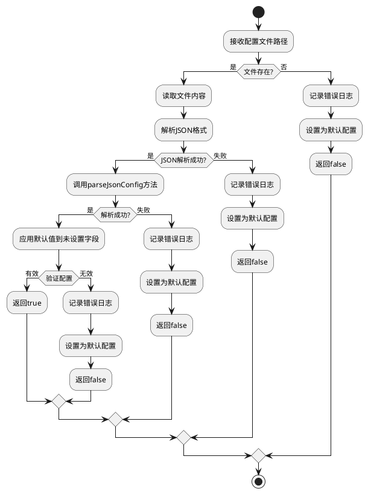

**ConfigManager::mergeWithCommandLineOptions方法流程**

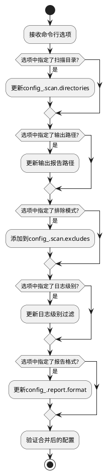

#### 错误处理

ConfigManager类的错误处理主要体现在以下几个方面：

1. **文件读取错误**：
   - 当配置文件不存在或无法读取时，loadConfig方法会返回false
   - 记录详细的错误日志，包括文件路径和错误原因
   - 自动使用默认配置继续执行

2. **JSON解析错误**：
   - 当配置文件不是有效的JSON格式时，会捕获解析异常
   - 记录具体的解析错误位置和原因
   - 返回false并使用默认配置

3. **配置验证错误**：
   - 配置项类型错误（如使用字符串表示应该是数字的值）
   - 必需配置项缺失
   - 配置项值超出有效范围
   - 依赖的配置项不满足条件（如启用了一个功能但相关配置不完整）

4. **默认配置保障**：
   - 无论发生什么错误，系统都会使用内置的默认配置确保程序能够正常运行
   - 默认配置中包含最基本的设置，足以进行标准的分析任务

5. **配置变更通知**：
   - 当配置项被自动修正或使用默认值替代时，会记录警告级别的日志
   - 提示用户可能需要检查配置文件

### 源文件管理模块设计

#### 模块功能

源文件管理模块负责收集、筛选和管理需要进行分析的C++源代码文件。该模块根据配置的扫描路径和排除规则，扫描文件系统，识别符合条件的源文件，并为后续的AST分析做准备。

该模块的主要功能包括：
1. 递归扫描指定目录下的所有文件
2. 根据文件扩展名和配置的文件类型进行筛选
3. 应用排除规则过滤不需要分析的文件
4. 解析源文件的基本信息，如绝对路径、相对路径等
5. 管理源文件集合，提供文件访问接口

#### 主要接口

源文件管理模块主要由SourceManager类和SourceFile类组成，以下是它们的主要接口：

**SourceFile类**

```cpp
/**
 * @class SourceFile
 * @brief 源文件类
 *
 * 表示一个需要分析的C++源代码文件
 */
class SourceFile {
public:
    /**
     * @brief 构造函数
     *
     * @param absolutePath 文件的绝对路径
     * @param relativePath 文件的相对路径
     */
    SourceFile(const std::string& absolutePath, const std::string& relativePath);

    /**
     * @brief 获取文件的绝对路径
     *
     * @return const std::string& 绝对路径
     */
    const std::string& getAbsolutePath() const;

    /**
     * @brief 获取文件的相对路径
     *
     * @return const std::string& 相对路径
     */
    const std::string& getRelativePath() const;

    /**
     * @brief 获取文件的扩展名
     *
     * @return std::string 扩展名
     */
    std::string getExtension() const;

    /**
     * @brief 获取文件名（不含路径）
     *
     * @return std::string 文件名
     */
    std::string getFileName() const;

    /**
     * @brief 检查文件是否存在
     *
     * @return bool 文件是否存在
     */
    bool exists() const;

    /**
     * @brief 读取文件内容
     *
     * @return std::string 文件内容
     */
    std::string readContent() const;

    /**
     * @brief 获取文件大小
     *
     * @return std::size_t 文件大小（字节）
     */
    std::size_t getSize() const;

private:
    std::string absolutePath_;              ///< 文件的绝对路径
    std::string relativePath_;              ///< 文件的相对路径
};

/**
 * @class SourceManager
 * @brief 源文件管理器
 *
 * 负责收集和管理需要分析的源代码文件
 */
class SourceManager {
public:
    /**
     * @brief 构造函数
     *
     * @param config 配置对象的引用
     */
    explicit SourceManager(const Config& config);

    /**
     * @brief 析构函数
     */
    ~SourceManager();

    /**
     * @brief 扫描源文件
     *
     * @return bool 扫描是否成功
     */
    bool scanSourceFiles();

    /**
     * @brief 获取所有收集到的源文件
     *
     * @return const std::vector<SourceFile>& 源文件集合
     */
    const std::vector<SourceFile>& getSourceFiles() const;

    /**
     * @brief 获取源文件总数
     *
     * @return std::size_t 源文件数量
     */
    std::size_t getSourceFileCount() const;

    /**
     * @brief 根据路径获取特定源文件
     *
     * @param path 文件路径
     * @return const SourceFile* 源文件指针，如果不存在则返回nullptr
     */
    const SourceFile* getSourceFile(const std::string& path) const;

    /**
     * @brief 检查文件是否应该被排除
     *
     * @param path 文件路径
     * @return bool 是否应该排除
     */
    bool shouldExclude(const std::string& path) const;

    /**
     * @brief 检查文件是否是支持的源文件类型
     *
     * @param path 文件路径
     * @return bool 是否是支持的源文件类型
     */
    bool isSupportedSourceFile(const std::string& path) const;

private:
    const Config& config_;                  ///< 配置对象引用
    std::vector<SourceFile> sourceFiles_;   ///< 收集到的源文件集合
    std::vector<std::regex> excludePatterns_; ///< 编译后的排除正则表达式

    /**
     * @brief 递归扫描目录
     *
     * @param directoryPath 目录路径
     * @param basePath 基础路径（用于计算相对路径）
     */
    void scanDirectory(const std::string& directoryPath, const std::string& basePath);

    /**
     * @brief 编译排除模式正则表达式
     */
    void compileExcludePatterns();
};
```

#### 逻辑流程

**SourceManager::scanSourceFiles方法流程**

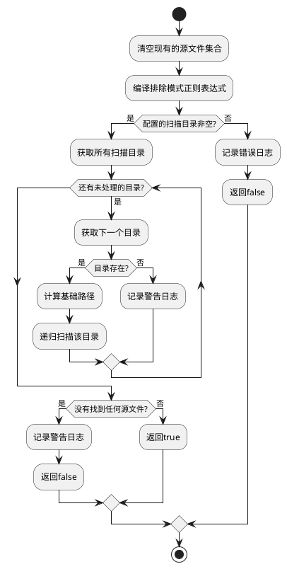

**SourceManager::scanDirectory方法流程**

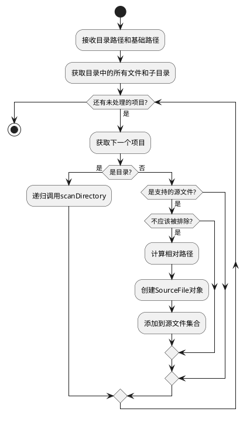

#### 错误处理

SourceManager类的错误处理主要体现在以下几个方面：

1. **目录不存在或无法访问**：
   - 当指定的扫描目录不存在或无法访问时，记录警告日志
   - 跳过该目录，继续处理其他目录
   - 如果所有目录都无法访问，返回false

2. **正则表达式编译错误**：
   - 当排除模式的正则表达式无法编译时，捕获异常
   - 记录错误日志，说明具体的正则表达式和错误原因
   - 忽略该排除模式，继续使用其他有效的排除模式

3. **文件读取错误**：
   - 当无法读取文件内容时，SourceFile::readContent方法会捕获异常
   - 返回空字符串，并记录错误日志
   - 调用方需要检查返回值，确保文件内容有效

4. **空结果处理**：
   - 当没有找到任何符合条件的源文件时，记录警告日志
   - 返回false，通知调用方没有找到可分析的文件

5. **内存管理**：
   - 使用标准容器和智能指针，避免内存泄漏
   - 大型文件集合时注意内存使用效率，避免不必要的复制

### AST分析模块设计

#### 模块功能

AST分析模块是DLogCover系统的核心组件，负责解析C++源代码，生成抽象语法树（AST），并遍历AST以识别代码中的各种结构。该模块最近进行了重要升级，增强了上下文管理、错误处理和性能优化能力。该模块利用Clang/LLVM提供的强大的C++解析能力，为日志识别模块提供必要的代码结构信息。

该模块的主要功能包括：
1. 创建和管理Clang编译器实例，配置相应的编译选项
2. 解析C++源文件，生成和管理抽象语法树
3. 维护AST单元和上下文的生命周期
4. 遍历AST，识别函数定义、条件分支和异常处理块
5. 提取这些代码结构的位置信息、名称和其他属性
6. 提供增量分析能力，优化大型代码库的分析性能
7. 为后续的日志覆盖率分析提供基础数据

#### 主要接口

AST分析模块主要由ASTAnalyzer类及相关的访问者类组成，以下是它们的主要接口：

**ASTAnalyzer类**

```cpp
/**
 * @class ASTAnalyzer
 * @brief AST分析器
 *
 * 负责解析C++源文件并分析其抽象语法树
 */
class ASTAnalyzer {
public:
    /**
     * @brief 构造函数
     *
     * @param config 配置对象的引用
     * @param sourceManager 源文件管理器的引用
     */
    ASTAnalyzer(const config::Config& config, const source_manager::SourceManager& sourceManager);

    /**
     * @brief 析构函数
     */
    ~ASTAnalyzer();

    /**
     * @brief 分析单个文件
     *
     * @param filePath 文件路径
     * @return bool 分析是否成功
     */
    bool analyze(const std::string& filePath);

    /**
     * @brief 分析所有文件
     *
     * @return bool 分析是否成功
     */
    bool analyzeAll();

    /**
     * @brief 获取AST节点信息
     *
     * @param filePath 文件路径
     * @return const ASTNodeInfo* AST节点信息指针
     */
    const ASTNodeInfo* getASTNodeInfo(const std::string& filePath) const;

    /**
     * @brief 获取所有AST节点信息
     *
     * @return const std::unordered_map<std::string, std::unique_ptr<ASTNodeInfo>>& AST节点信息映射表
     */
    const std::unordered_map<std::string, std::unique_ptr<ASTNodeInfo>>& getAllASTNodeInfo() const;

    /**
     * @brief 获取当前AST单元
     *
     * @return clang::ASTUnit* 当前AST单元指针
     */
    clang::ASTUnit* getCurrentASTUnit() const;

    /**
     * @brief 获取当前上下文
     *
     * @return clang::ASTContext* 当前上下文指针
     */
    clang::ASTContext* getCurrentContext() const;

    /**
     * @brief 清理当前AST单元
     */
    void clearCurrentASTUnit();

    /**
     * @brief 清理当前上下文
     */
    void clearCurrentContext();

private:
    // 配置信息
    const config::Config& config_;

    // 源文件管理器引用
    const source_manager::SourceManager& sourceManager_;

    // 当前处理的AST单元
    std::unique_ptr<clang::ASTUnit> currentASTUnit_;

    // 当前AST上下文
    clang::ASTContext* currentContext_;

    // AST节点信息映射表
    std::unordered_map<std::string, std::unique_ptr<ASTNodeInfo>> astNodeInfoMap_;

    /**
     * @brief 初始化编译器实例
     *
     * @param CI 编译器实例
     * @param filePath 文件路径
     * @return bool 初始化是否成功
     */
    bool initializeCompilerInstance(clang::CompilerInstance& CI, const std::string& filePath);

    /**
     * @brief 处理AST上下文
     *
     * @param Context AST上下文
     * @param filePath 文件路径
     * @return bool 处理是否成功
     */
    bool processASTContext(clang::ASTContext& Context, const std::string& filePath);

    /**
     * @brief 遍历AST
     *
     * @param Context AST上下文
     * @param filePath 文件路径
     */
    void traverseAST(clang::ASTContext& Context, const std::string& filePath);

    /**
     * @brief 处理函数声明
     *
     * @param FD 函数声明
     * @param nodeInfo AST节点信息
     */
    void handleFunctionDecl(const clang::FunctionDecl* FD, ASTNodeInfo& nodeInfo);

    /**
     * @brief 处理条件语句
     *
     * @param IS if语句
     * @param nodeInfo AST节点信息
     */
    void handleIfStmt(const clang::IfStmt* IS, ASTNodeInfo& nodeInfo);

    /**
     * @brief 处理循环语句
     *
     * @param Loop 循环语句
     * @param nodeInfo AST节点信息
     */
    void handleLoopStmt(const clang::Stmt* Loop, ASTNodeInfo& nodeInfo);

    /**
     * @brief 处理异常处理
     *
     * @param TS try语句
     * @param nodeInfo AST节点信息
     */
    void handleCXXTryStmt(const clang::CXXTryStmt* TS, ASTNodeInfo& nodeInfo);
};
```

**ASTAnalysisResult类**

```cpp
/**
 * @struct FunctionInfo
 * @brief 函数信息结构
 */
struct FunctionInfo {
    std::string name;                       ///< 函数名称
    std::string qualifiedName;              ///< 限定名称（包含命名空间）
    clang::SourceRange sourceRange;         ///< 源代码范围
    clang::SourceLocation startLocation;    ///< 开始位置
    clang::SourceLocation endLocation;      ///< 结束位置
    bool isMethod;                          ///< 是否是类的方法
    std::string className;                  ///< 如果是方法，所属的类名
    bool isInline;                          ///< 是否是内联函数
    bool isTemplate;                        ///< 是否是模板函数
    std::vector<std::string> parameters;    ///< 参数列表
    std::string returnType;                 ///< 返回类型
};

/**
 * @struct BranchInfo
 * @brief 分支信息结构
 */
struct BranchInfo {
    enum class Type {
        IF,                                 ///< if语句
        ELSE,                               ///< else语句
        SWITCH_CASE,                        ///< switch-case语句
        FOR,                                ///< for循环
        WHILE,                              ///< while循环
        DO_WHILE                            ///< do-while循环
    };

    Type type;                              ///< 分支类型
    clang::SourceRange sourceRange;         ///< 源代码范围
    clang::SourceLocation conditionLocation; ///< 条件表达式位置
    std::string parentFunction;             ///< 所属函数的限定名称
};

/**
 * @struct ExceptionInfo
 * @brief 异常处理信息结构
 */
struct ExceptionInfo {
    enum class Type {
        TRY,                                ///< try块
        CATCH,                              ///< catch块
        THROW                               ///< throw语句
    };

    Type type;                              ///< 异常类型
    clang::SourceRange sourceRange;         ///< 源代码范围
    std::string caughtType;                 ///< 捕获的异常类型（仅对catch有效）
    std::string parentFunction;             ///< 所属函数的限定名称
};

/**
 * @class ASTAnalysisResult
 * @brief AST分析结果
 */
class ASTAnalysisResult {
public:
    /**
     * @brief 构造函数
     */
    ASTAnalysisResult();

    /**
     * @brief 添加函数信息
     *
     * @param info 函数信息
     */
    void addFunction(const FunctionInfo& info);

    /**
     * @brief 添加分支信息
     *
     * @param info 分支信息
     */
    void addBranch(const BranchInfo& info);

    /**
     * @brief 添加异常处理信息
     *
     * @param info 异常处理信息
     */
    void addException(const ExceptionInfo& info);

    /**
     * @brief 获取所有函数信息
     *
     * @return const std::vector<FunctionInfo>& 函数信息列表
     */
    const std::vector<FunctionInfo>& getFunctions() const;

    /**
     * @brief 获取所有分支信息
     *
     * @return const std::vector<BranchInfo>& 分支信息列表
     */
    const std::vector<BranchInfo>& getBranches() const;

    /**
     * @brief 获取所有异常处理信息
     *
     * @return const std::vector<ExceptionInfo>& 异常处理信息列表
     */
    const std::vector<ExceptionInfo>& getExceptions() const;

    /**
     * @brief 清除所有结果
     */
    void clear();

    /**
     * @brief 获取结果是否为空
     *
     * @return bool 结果是否为空
     */
    bool isEmpty() const;

private:
    std::vector<FunctionInfo> functions_;   ///< 函数信息列表
    std::vector<BranchInfo> branches_;      ///< 分支信息列表
    std::vector<ExceptionInfo> exceptions_; ///< 异常处理信息列表
};
```

**ASTVisitor类**

```cpp
/**
 * @class DLogCoverASTVisitor
 * @brief DLogCover AST访问者
 *
 * 遍历AST并收集所需信息的访问者类
 */
class DLogCoverASTVisitor : public clang::RecursiveASTVisitor<DLogCoverASTVisitor> {
public:
    /**
     * @brief 构造函数
     *
     * @param result 分析结果对象的引用
     * @param srcMgr 源代码管理器的引用
     * @param config 配置对象的引用
     */
    DLogCoverASTVisitor(ASTAnalysisResult& result,
                         clang::SourceManager& srcMgr,
                         const Config& config);

    /**
     * @brief 访问函数声明
     *
     * @param decl 函数声明
     * @return bool 是否继续访问
     */
    bool VisitFunctionDecl(clang::FunctionDecl* decl);

    /**
     * @brief 访问方法声明
     *
     * @param decl 方法声明
     * @return bool 是否继续访问
     */
    bool VisitCXXMethodDecl(clang::CXXMethodDecl* decl);

    /**
     * @brief 访问if语句
     *
     * @param stmt if语句
     * @return bool 是否继续访问
     */
    bool VisitIfStmt(clang::IfStmt* stmt);

    /**
     * @brief 访问switch语句
     *
     * @param stmt switch语句
     * @return bool 是否继续访问
     */
    bool VisitSwitchStmt(clang::SwitchStmt* stmt);

    /**
     * @brief 访问for语句
     *
     * @param stmt for语句
     * @return bool 是否继续访问
     */
    bool VisitForStmt(clang::ForStmt* stmt);

    /**
     * @brief 访问while语句
     *
     * @param stmt while语句
     * @return bool 是否继续访问
     */
    bool VisitWhileStmt(clang::WhileStmt* stmt);

    /**
     * @brief 访问try语句
     *
     * @param stmt try语句
     * @return bool 是否继续访问
     */
    bool VisitCXXTryStmt(clang::CXXTryStmt* stmt);

    /**
     * @brief 访问catch语句
     *
     * @param stmt catch语句
     * @return bool 是否继续访问
     */
    bool VisitCXXCatchStmt(clang::CXXCatchStmt* stmt);

    /**
     * @brief 访问throw表达式
     *
     * @param expr throw表达式
     * @return bool 是否继续访问
     */
    bool VisitCXXThrowExpr(clang::CXXThrowExpr* expr);

private:
    ASTAnalysisResult& result_;             ///< 分析结果引用
    clang::SourceManager& srcMgr_;          ///< 源代码管理器引用
    const Config& config_;                  ///< 配置对象引用
    std::stack<clang::FunctionDecl*> functionStack_; ///< 函数调用栈

    /**
     * @brief 获取当前函数
     *
     * @return clang::FunctionDecl* 当前函数声明
     */
    clang::FunctionDecl* getCurrentFunction() const;

    /**
     * @brief 获取完全限定名称
     *
     * @param decl 命名声明
     * @return std::string 完全限定名称
     */
    std::string getQualifiedName(clang::NamedDecl* decl) const;
};
```

**ASTConsumer类**

```cpp
/**
 * @class DLogCoverASTConsumer
 * @brief DLogCover AST消费者
 *
 * 处理AST的消费者类
 */
class DLogCoverASTConsumer : public clang::ASTConsumer {
public:
    /**
     * @brief 构造函数
     *
     * @param result 分析结果对象的引用
     * @param config 配置对象的引用
     */
    DLogCoverASTConsumer(ASTAnalysisResult& result, const Config& config);

    /**
     * @brief 处理翻译单元
     *
     * @param ctx AST上下文
     */
    void HandleTranslationUnit(clang::ASTContext& ctx) override;

private:
    ASTAnalysisResult& result_;             ///< 分析结果引用
    const Config& config_;                  ///< 配置对象引用
};
```

#### 逻辑流程

**ASTAnalyzer::analyzeSourceFile方法流程**

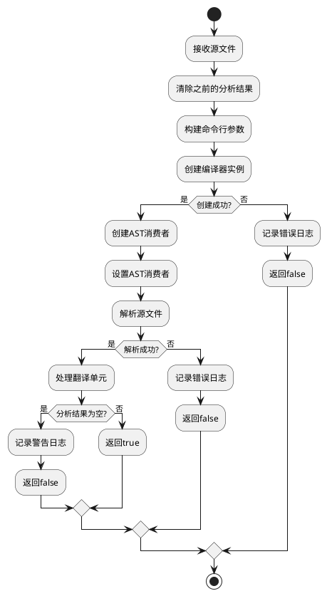

**DLogCoverASTVisitor访问流程**

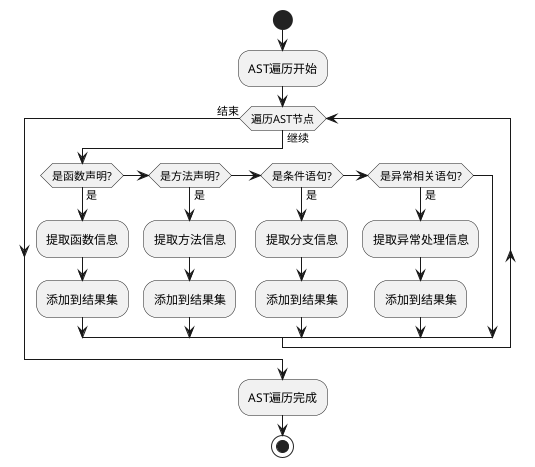

#### 错误处理

AST分析模块的错误处理主要体现在以下几个方面：

1. **编译器实例创建失败**：
   - 当无法创建Clang编译器实例时，记录错误日志
   - 返回false，通知调用方分析失败
   - 详细记录可能的原因，如资源不足、配置错误等

2. **源文件解析错误**：
   - 当源文件语法错误或无法解析时，捕获Clang抛出的诊断信息
   - 将诊断信息转换为用户友好的错误消息
   - 记录具体的错误位置和原因，方便用户定位问题
   - 在`initializeCompilerInstance()`中添加了更详细的错误检查
   - 在`processASTContext()`中增加了上下文验证

3. **AST遍历异常**：
   - 使用try-catch块包装AST遍历过程
   - 捕获可能的异常，防止因单个节点处理问题导致整个分析中断
   - 记录异常信息，继续处理其他节点
   - 改进了节点访问策略，减少不必要的遍历
   - 增加了对复杂语言特性的支持

4. **上下文管理错误**：
   - 添加了`currentASTUnit_`和`currentContext_`成员变量的状态检查
   - 在状态转换时进行严格的错误检查
   - 提供了`clearCurrentASTUnit()`和`clearCurrentContext()`方法用于安全清理
   - 确保上下文的生命周期管理正确

5. **空结果处理**：
   - 当分析完成但没有收集到任何有效信息时，记录警告日志
   - 返回false，通知调用方分析结果可能不完整
   - 这种情况可能是由于源文件不包含任何函数定义、条件分支或异常处理
   - 添加了更详细的日志记录，帮助诊断问题原因

6. **内存管理**：
   - 优化了AST节点缓存策略
   - 改进了内存管理机制，及时释放不再需要的资源
   - 使用智能指针管理AST单元和节点信息的生命周期
   - 实现了增量分析能力，减少内存占用
   - 使用引用和指针减少大对象复制
   - Clang对象的生命周期管理，避免悬空指针

### 日志识别模块设计

#### 模块功能

日志识别模块负责在AST中识别和提取日志函数调用，是DLogCover系统的关键组件之一。该模块根据配置识别不同类型的日志函数调用，如Qt日志函数（qDebug、qInfo等）、Qt分类日志函数以及用户自定义的日志函数，并提取调用点的详细信息。

该模块的主要功能包括：
1. 根据配置识别不同类型的日志函数调用
2. 提取日志调用点的位置信息、所属函数和调用上下文
3. 识别日志级别（如DEBUG、INFO、WARNING等）
4. 支持自定义日志函数的识别规则
5. 提供日志调用点与代码结构（函数、分支、异常处理）的关联关系

#### 主要接口

日志识别模块主要由LogIdentifier类及相关辅助类组成，以下是它们的主要接口：

**LogCallSite类**

```cpp
/**
 * @enum LogLevel
 * @brief 日志级别枚举
 */
enum class LogLevel {
    DEBUG,                              ///< 调试级别
    INFO,                               ///< 信息级别
    WARNING,                            ///< 警告级别
    ERROR,                              ///< 错误级别
    CRITICAL,                           ///< 严重级别
    FATAL,                              ///< 致命级别
    UNKNOWN                             ///< 未知级别
};

/**
 * @enum LogType
 * @brief 日志类型枚举
 */
enum class LogType {
    QT_LOG,                             ///< Qt日志
    QT_CATEGORY_LOG,                    ///< Qt分类日志
    CUSTOM_LOG,                         ///< 自定义日志
    UNKNOWN                             ///< 未知类型
};

/**
 * @class LogCallSite
 * @brief 日志调用点
 *
 * 表示代码中的一个日志函数调用
 */
class LogCallSite {
public:
    /**
     * @brief 构造函数
     *
     * @param functionName 日志函数名称
     * @param sourceRange 源代码范围
     * @param parentFunction 所属函数
     * @param logLevel 日志级别
     * @param logType 日志类型
     */
    LogCallSite(const std::string& functionName,
                const clang::SourceRange& sourceRange,
                const std::string& parentFunction,
                LogLevel logLevel = LogLevel::UNKNOWN,
                LogType logType = LogType::UNKNOWN);

    /**
     * @brief 获取日志函数名称
     *
     * @return const std::string& 函数名称
     */
    const std::string& getFunctionName() const;

    /**
     * @brief 获取源代码范围
     *
     * @return const clang::SourceRange& 源代码范围
     */
    const clang::SourceRange& getSourceRange() const;

    /**
     * @brief 获取所属函数
     *
     * @return const std::string& 所属函数
     */
    const std::string& getParentFunction() const;

    /**
     * @brief 获取日志级别
     *
     * @return LogLevel 日志级别
     */
    LogLevel getLogLevel() const;

    /**
     * @brief 获取日志类型
     *
     * @return LogType 日志类型
     */
    LogType getLogType() const;

    /**
     * @brief 设置所属分支
     *
     * @param branchIndex 分支索引
     */
    void setBranchIndex(std::size_t branchIndex);

    /**
     * @brief 获取所属分支
     *
     * @return std::size_t 分支索引
     */
    std::size_t getBranchIndex() const;

    /**
     * @brief 设置所属异常处理块
     *
     * @param exceptionIndex 异常处理块索引
     */
    void setExceptionIndex(std::size_t exceptionIndex);

    /**
     * @brief 获取所属异常处理块
     *
     * @return std::size_t 异常处理块索引
     */
    std::size_t getExceptionIndex() const;

    /**
     * @brief 获取日志级别的字符串表示
     *
     * @param level 日志级别
     * @return std::string 字符串表示
     */
    static std::string logLevelToString(LogLevel level);

    /**
     * @brief 从字符串解析日志级别
     *
     * @param levelStr 日志级别字符串
     * @return LogLevel 日志级别
     */
    static LogLevel logLevelFromString(const std::string& levelStr);

private:
    std::string functionName_;              ///< 日志函数名称
    clang::SourceRange sourceRange_;        ///< 源代码范围
    std::string parentFunction_;            ///< 所属函数
    LogLevel logLevel_;                     ///< 日志级别
    LogType logType_;                       ///< 日志类型
    std::size_t branchIndex_;               ///< 所属分支索引
    std::size_t exceptionIndex_;            ///< 所属异常处理块索引
};
```

**LogIdentifier类**

```cpp
/**
 * @class LogIdentifier
 * @brief 日志识别器
 *
 * 负责识别代码中的日志函数调用
 */
class LogIdentifier {
public:
    /**
     * @brief 构造函数
     *
     * @param config 配置对象的引用
     */
    explicit LogIdentifier(const Config& config);

    /**
     * @brief 析构函数
     */
    ~LogIdentifier();

    /**
     * @brief 识别源文件中的日志调用
     *
     * @param astResult AST分析结果
     * @param sourceFile 源文件
     * @return bool 识别是否成功
     */
    bool identifyLogCalls(const ASTAnalysisResult& astResult, const SourceFile& sourceFile);

    /**
     * @brief 获取识别到的日志调用点
     *
     * @return const std::vector<LogCallSite>& 日志调用点列表
     */
    const std::vector<LogCallSite>& getLogCallSites() const;

    /**
     * @brief 获取日志调用点数量
     *
     * @return std::size_t 日志调用点数量
     */
    std::size_t getLogCallSiteCount() const;

    /**
     * @brief 清除识别结果
     */
    void clearResults();

    /**
     * @brief 为日志调用点关联代码结构
     *
     * @param astResult AST分析结果
     */
    void associateWithCodeStructures(const ASTAnalysisResult& astResult);

private:
    const Config& config_;                  ///< 配置对象引用
    std::vector<LogCallSite> logCallSites_; ///< 识别到的日志调用点

    /**
     * @brief 识别Qt日志函数调用
     *
     * @param astResult AST分析结果
     * @param sourceFile 源文件
     */
    void identifyQtLogCalls(const ASTAnalysisResult& astResult, const SourceFile& sourceFile);

    /**
     * @brief 识别Qt分类日志函数调用
     *
     * @param astResult AST分析结果
     * @param sourceFile 源文件
     */
    void identifyQtCategoryLogCalls(const ASTAnalysisResult& astResult, const SourceFile& sourceFile);

    /**
     * @brief 识别自定义日志函数调用
     *
     * @param astResult AST分析结果
     * @param sourceFile 源文件
     */
    void identifyCustomLogCalls(const ASTAnalysisResult& astResult, const SourceFile& sourceFile);

    /**
     * @brief 从函数名获取日志级别
     *
     * @param functionName 函数名
     * @return LogLevel 日志级别
     */
    LogLevel getLogLevelFromFunctionName(const std::string& functionName) const;

    /**
     * @brief 检查调用表达式是否是日志函数调用
     *
     * @param callExpr 调用表达式
     * @param functionNames 函数名列表
     * @return bool 是否是日志函数调用
     */
    bool isLogFunctionCall(const clang::CallExpr* callExpr, const std::vector<std::string>& functionNames) const;
};
```

**LogCallFinder类**

```cpp
/**
 * @class LogCallFinder
 * @brief 日志调用查找器
 *
 * 在AST中查找日志函数调用的访问者类
 */
class LogCallFinder : public clang::RecursiveASTVisitor<LogCallFinder> {
public:
    /**
     * @brief 构造函数
     *
     * @param logIdentifier 日志识别器的引用
     * @param srcMgr 源代码管理器的引用
     * @param config 配置对象的引用
     */
    LogCallFinder(LogIdentifier& logIdentifier,
                  clang::SourceManager& srcMgr,
                  const Config& config);

    /**
     * @brief 访问调用表达式
     *
     * @param callExpr 调用表达式
     * @return bool 是否继续访问
     */
    bool VisitCallExpr(clang::CallExpr* callExpr);

private:
    LogIdentifier& logIdentifier_;          ///< 日志识别器引用
    clang::SourceManager& srcMgr_;          ///< 源代码管理器引用
    const Config& config_;                  ///< 配置对象引用

    /**
     * @brief 获取调用表达式所属的函数
     *
     * @param callExpr 调用表达式
     * @return std::string 所属函数的名称
     */
    std::string getParentFunctionName(const clang::CallExpr* callExpr) const;
};
```

#### 逻辑流程

**LogIdentifier::identifyLogCalls方法流程**

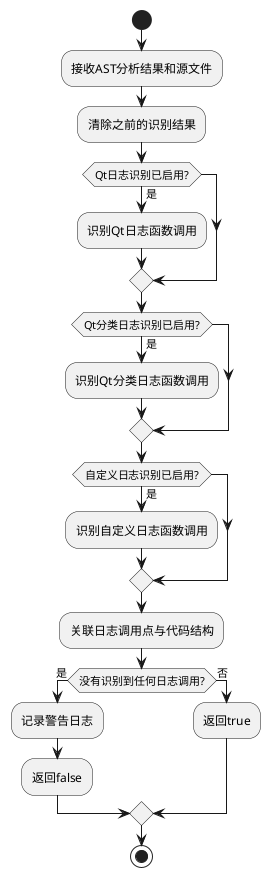

**LogIdentifier::associateWithCodeStructures方法流程**

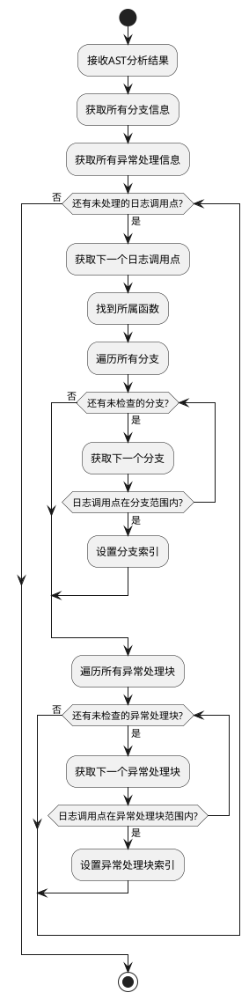

#### 错误处理

LogIdentifier类的错误处理主要体现在以下几个方面：

1. **AST遍历异常**：
   - 在查找日志调用时使用try-catch块捕获可能的异常
   - 记录详细的异常信息，包括异常类型和出现位置
   - 跳过有问题的AST节点，继续处理其他节点

2. **配置错误处理**：
   - 当日志函数配置无效或不完整时，记录警告日志
   - 使用默认配置继续处理
   - 在结果中标记可能由于配置问题导致的不准确数据

3. **位置信息错误**：
   - 当无法获取准确的源代码位置信息时，记录警告
   - 使用近似位置或默认位置代替，确保分析可以继续
   - 在结果中标记这些位置信息可能不准确

4. **函数识别错误**：
   - 当无法确定日志调用所属的函数时，记录为"未知函数"
   - 这种情况可能发生在宏定义内部的日志调用或全局范围的调用

5. **空结果处理**：
   - 当没有识别到任何日志调用时，记录警告日志
   - 返回false，通知调用方没有找到日志调用
   - 这种情况可能意味着代码中确实没有日志，或者配置的日志函数名称不正确

5. **内存管理**：
   - 注意处理大型AST时的内存使用
   - 使用引用和指针减少大对象复制
   - Clang对象的生命周期管理，避免悬空指针

### 覆盖率计算模块设计

#### 模块功能

覆盖率计算模块负责基于代码结构信息和日志调用点信息，计算各种类型的日志覆盖率指标。该模块是DLogCover系统的核心分析组件，将AST分析模块和日志识别模块的结果进行关联，生成有意义的覆盖率统计数据。

该模块的主要功能包括：
1. 计算函数级日志覆盖率，统计包含日志的函数比例
2. 计算分支级日志覆盖率，统计包含日志的条件分支比例
3. 计算异常处理级日志覆盖率，统计包含日志的异常处理块比例
4. 计算关键路径日志覆盖率，识别代码中的关键路径并统计其日志覆盖情况
5. 生成总体覆盖率统计数据，包括不同日志级别的覆盖情况
6. 标识可能需要添加日志的代码区域

#### 主要接口

覆盖率计算模块主要由CoverageCalculator类及相关辅助类组成，以下是它们的主要接口：

**CoverageStatistics类**

```cpp
/**
 * @class CoverageStatistics
 * @brief 覆盖率统计数据
 *
 * 存储各种类型的覆盖率统计数据
 */
class CoverageStatistics {
public:
    /**
     * @brief 构造函数
     */
    CoverageStatistics();

    /**
     * @brief 设置函数覆盖率数据
     *
     * @param covered 已覆盖函数数量
     * @param total 总函数数量
     */
    void setFunctionCoverage(std::size_t covered, std::size_t total);

    /**
     * @brief 设置分支覆盖率数据
     *
     * @param covered 已覆盖分支数量
     * @param total 总分支数量
     */
    void setBranchCoverage(std::size_t covered, std::size_t total);

    /**
     * @brief 设置异常处理覆盖率数据
     *
     * @param covered 已覆盖异常处理块数量
     * @param total 总异常处理块数量
     */
    void setExceptionCoverage(std::size_t covered, std::size_t total);

    /**
     * @brief 设置关键路径覆盖率数据
     *
     * @param covered 已覆盖关键路径数量
     * @param total 总关键路径数量
     */
    void setKeyPathCoverage(std::size_t covered, std::size_t total);

    /**
     * @brief 设置按日志级别的覆盖率数据
     *
     * @param level 日志级别
     * @param covered 已覆盖数量
     * @param total 总数量
     */
    void setLogLevelCoverage(LogLevel level, std::size_t covered, std::size_t total);

    /**
     * @brief 获取函数覆盖率百分比
     *
     * @return double 函数覆盖率百分比
     */
    double getFunctionCoveragePercentage() const;

    /**
     * @brief 获取分支覆盖率百分比
     *
     * @return double 分支覆盖率百分比
     */
    double getBranchCoveragePercentage() const;

    /**
     * @brief 获取异常处理覆盖率百分比
     *
     * @return double 异常处理覆盖率百分比
     */
    double getExceptionCoveragePercentage() const;

    /**
     * @brief 获取关键路径覆盖率百分比
     *
     * @return double 关键路径覆盖率百分比
     */
    double getKeyPathCoveragePercentage() const;

    /**
     * @brief 获取总体覆盖率百分比
     *
     * @return double 总体覆盖率百分比
     */
    double getOverallCoveragePercentage() const;

    /**
     * @brief 获取指定日志级别的覆盖率百分比
     *
     * @param level 日志级别
     * @return double 该日志级别的覆盖率百分比
     */
    double getLogLevelCoveragePercentage(LogLevel level) const;

    /**
     * @brief 获取函数覆盖率数据
     *
     * @return std::pair<std::size_t, std::size_t> 已覆盖函数数量和总函数数量
     */
    std::pair<std::size_t, std::size_t> getFunctionCoverage() const;

    /**
     * @brief 获取分支覆盖率数据
     *
     * @return std::pair<std::size_t, std::size_t> 已覆盖分支数量和总分支数量
     */
    std::pair<std::size_t, std::size_t> getBranchCoverage() const;

    /**
     * @brief 获取异常处理覆盖率数据
     *
     * @return std::pair<std::size_t, std::size_t> 已覆盖异常处理块数量和总异常处理块数量
     */
    std::pair<std::size_t, std::size_t> getExceptionCoverage() const;

    /**
     * @brief 获取关键路径覆盖率数据
     *
     * @return std::pair<std::size_t, std::size_t> 已覆盖关键路径数量和总关键路径数量
     */
    std::pair<std::size_t, std::size_t> getKeyPathCoverage() const;

    /**
     * @brief 获取所有日志级别的覆盖率数据
     *
     * @return std::map<LogLevel, std::pair<std::size_t, std::size_t>> 各日志级别的覆盖率数据
     */
    const std::map<LogLevel, std::pair<std::size_t, std::size_t>>& getLogLevelCoverage() const;

private:
    std::pair<std::size_t, std::size_t> functionCoverage_;   ///< 函数覆盖率数据
    std::pair<std::size_t, std::size_t> branchCoverage_;     ///< 分支覆盖率数据
    std::pair<std::size_t, std::size_t> exceptionCoverage_;  ///< 异常处理覆盖率数据
    std::pair<std::size_t, std::size_t> keyPathCoverage_;    ///< 关键路径覆盖率数据
    std::map<LogLevel, std::pair<std::size_t, std::size_t>> logLevelCoverage_; ///< 按日志级别的覆盖率数据

    /**
     * @brief 计算覆盖率百分比
     *
     * @param covered 已覆盖数量
     * @param total 总数量
     * @return double 覆盖率百分比
     */
    static double calculatePercentage(std::size_t covered, std::size_t total);
};
```

**CoverageCalculator类**

```cpp
/**
 * @class CoverageCalculator
 * @brief 覆盖率计算器
 *
 * 负责计算各种类型的覆盖率指标
 */
class CoverageCalculator {
public:
    /**
     * @brief 构造函数
     *
     * @param config 配置对象的引用
     */
    explicit CoverageCalculator(const Config& config);

    /**
     * @brief 析构函数
     */
    ~CoverageCalculator();

    /**
     * @brief 计算覆盖率
     *
     * @param astResult AST分析结果
     * @param logCallSites 日志调用点列表
     * @return bool 计算是否成功
     */
    bool calculateCoverage(const ASTAnalysisResult& astResult,
                           const std::vector<LogCallSite>& logCallSites);

    /**
     * @brief 获取覆盖率统计数据
     *
     * @return const CoverageStatistics& 覆盖率统计数据
     */
    const CoverageStatistics& getStatistics() const;

    /**
     * @brief 获取未覆盖的函数列表
     *
     * @return const std::vector<std::string>& 未覆盖的函数列表
     */
    const std::vector<std::string>& getUncoveredFunctions() const;

    /**
     * @brief 获取未覆盖的分支列表
     *
     * @return const std::vector<std::size_t>& 未覆盖的分支索引列表
     */
    const std::vector<std::size_t>& getUncoveredBranches() const;

    /**
     * @brief 获取未覆盖的异常处理块列表
     *
     * @return const std::vector<std::size_t>& 未覆盖的异常处理块索引列表
     */
    const std::vector<std::size_t>& getUncoveredExceptions() const;

private:
    const Config& config_;                  ///< 配置对象引用
    CoverageStatistics statistics_;         ///< 覆盖率统计数据
    std::vector<std::string> uncoveredFunctions_; ///< 未覆盖的函数列表
    std::vector<std::size_t> uncoveredBranches_;  ///< 未覆盖的分支列表
    std::vector<std::size_t> uncoveredExceptions_; ///< 未覆盖的异常处理块列表

    /**
     * @brief 计算函数覆盖率
     *
     * @param astResult AST分析结果
     * @param logCallSites 日志调用点列表
     */
    void calculateFunctionCoverage(const ASTAnalysisResult& astResult,
                                  const std::vector<LogCallSite>& logCallSites);

    /**
     * @brief 计算分支覆盖率
     *
     * @param astResult AST分析结果
     * @param logCallSites 日志调用点列表
     */
    void calculateBranchCoverage(const ASTAnalysisResult& astResult,
                                const std::vector<LogCallSite>& logCallSites);

    /**
     * @brief 计算异常处理覆盖率
     *
     * @param astResult AST分析结果
     * @param logCallSites 日志调用点列表
     */
    void calculateExceptionCoverage(const ASTAnalysisResult& astResult,
                                   const std::vector<LogCallSite>& logCallSites);

    /**
     * @brief 计算关键路径覆盖率
     *
     * @param astResult AST分析结果
     * @param logCallSites 日志调用点列表
     */
    void calculateKeyPathCoverage(const ASTAnalysisResult& astResult,
                                 const std::vector<LogCallSite>& logCallSites);

    /**
     * @brief 计算按日志级别的覆盖率
     *
     * @param logCallSites 日志调用点列表
     */
    void calculateLogLevelCoverage(const std::vector<LogCallSite>& logCallSites);

    /**
     * @brief 检查函数是否被覆盖
     *
     * @param function 函数信息
     * @param logCallSites 日志调用点列表
     * @return bool 函数是否被覆盖
     */
    bool isFunctionCovered(const FunctionInfo& function,
                          const std::vector<LogCallSite>& logCallSites) const;

    /**
     * @brief 检查分支是否被覆盖
     *
     * @param branch 分支信息
     * @param logCallSites 日志调用点列表
     * @return bool 分支是否被覆盖
     */
    bool isBranchCovered(const BranchInfo& branch,
                        const std::vector<LogCallSite>& logCallSites) const;

    /**
     * @brief 检查异常处理块是否被覆盖
     *
     * @param exception 异常处理信息
     * @param logCallSites 日志调用点列表
     * @return bool 异常处理块是否被覆盖
     */
    bool isExceptionCovered(const ExceptionInfo& exception,
                           const std::vector<LogCallSite>& logCallSites) const;
};
```

**KeyPathDetector类**

```cpp
/**
 * @class KeyPathDetector
 * @brief 关键路径检测器
 *
 * 负责识别代码中的关键路径
 */
class KeyPathDetector {
public:
    /**
     * @brief 构造函数
     *
     * @param config 配置对象的引用
     */
    explicit KeyPathDetector(const Config& config);

    /**
     * @brief 析构函数
     */
    ~KeyPathDetector();

    /**
     * @brief 检测关键路径
     *
     * @param astResult AST分析结果
     * @return std::vector<std::size_t> 关键路径的索引列表
     */
    std::vector<std::size_t> detectKeyPaths(const ASTAnalysisResult& astResult);

    /**
     * @brief 检查路径是否是关键路径
     *
     * @param path 路径信息
     * @return bool 是否是关键路径
     */
    bool isKeyPath(const PathInfo& path) const;

private:
    const Config& config_;                  ///< 配置对象引用

    /**
     * @brief 基于函数名和属性检测关键路径
     *
     * @param astResult AST分析结果
     * @return std::vector<std::size_t> 关键路径的索引列表
     */
    std::vector<std::size_t> detectKeyPathsByName(const ASTAnalysisResult& astResult);

    /**
     * @brief 基于调用图和复杂度检测关键路径
     *
     * @param astResult AST分析结果
     * @return std::vector<std::size_t> 关键路径的索引列表
     */
    std::vector<std::size_t> detectKeyPathsByComplexity(const ASTAnalysisResult& astResult);
};
```

#### 逻辑流程

**CoverageCalculator::calculateCoverage方法流程**

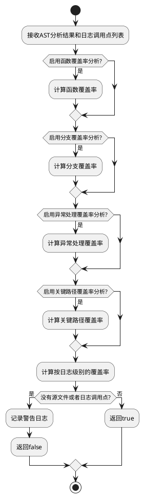

**CoverageCalculator::calculateFunctionCoverage方法流程**

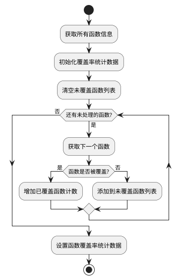

#### 错误处理

CoverageCalculator类的错误处理主要体现在以下几个方面：

1. **输入数据验证**：
   - 当AST分析结果或日志调用点列表为空时，记录警告日志
   - 返回false，通知调用方计算失败
   - 这种情况可能发生在之前的分析步骤出错或者源文件中确实没有代码结构

2. **零分母情况处理**：
   - 在计算覆盖率百分比时，处理分母为零的情况
   - 如果没有函数或分支等结构，相应的覆盖率视为100%或不适用

3. **配置错误处理**：
   - 当覆盖率计算配置无效时，记录警告日志
   - 使用默认配置继续计算
   - 在结果中标记可能由于配置问题导致的不准确数据

4. **关键路径检测异常**：
   - 当关键路径检测过程中发生异常时，捕获并记录错误
   - 跳过关键路径分析，继续其他覆盖率的计算
   - 在结果中标记关键路径覆盖率数据不可用

5. **分类统计异常**：
   - 处理日志级别未知或无法识别的情况
   - 将未识别的日志级别归类为UNKNOWN级别
   - 确保统计数据的完整性和一致性

6. **空结果处理**：
   - 当没有识别到任何日志调用时，记录警告日志
   - 返回false，通知调用方没有找到日志调用
   - 这种情况可能意味着代码中确实没有日志，或者配置的日志函数名称不正确

7. **内存管理**：
   - 注意处理大型AST时的内存使用
   - 使用引用和指针减少大对象复制
   - Clang对象的生命周期管理，避免悬空指针 ### 报告生成模块设计

#### 模块功能

报告生成模块负责将覆盖率计算的结果整理成易于理解的各种格式的报告，是DLogCover系统的输出组件。该模块支持生成文本格式和JSON格式的报告，详细展示日志覆盖情况，并提供可视化覆盖率信息和改进建议。

该模块的主要功能包括：
1. 生成文本格式的覆盖率报告，包括摘要信息和详细信息
2. 生成JSON格式的覆盖率报告，方便与其他工具集成
3. 提供覆盖率数据的可视化表示，如表格和图表
4. 生成日志覆盖改进建议，指出可能需要添加日志的代码位置
5. 支持将报告输出到文件或标准输出

#### 主要接口

报告生成模块主要由ReportGenerator类及其派生类组成，以下是它们的主要接口：

**ReportGenerator基类**

```cpp
/**
 * @class ReportGenerator
 * @brief 报告生成器基类
 *
 * 所有报告生成器的抽象基类
 */
class ReportGenerator {
public:
    /**
     * @brief 构造函数
     *
     * @param config 配置对象的引用
     */
    explicit ReportGenerator(const Config& config);

    /**
     * @brief 虚析构函数
     */
    virtual ~ReportGenerator();

    /**
     * @brief 生成报告
     *
     * @param sourceFile 源文件对象
     * @param statistics 覆盖率统计数据
     * @param logCallSites 日志调用点列表
     * @param uncoveredFunctions 未覆盖的函数列表
     * @param uncoveredBranches 未覆盖的分支列表
     * @param uncoveredExceptions 未覆盖的异常处理块列表
     * @return bool 生成是否成功
     */
    virtual bool generateReport(const SourceFile& sourceFile,
                               const CoverageStatistics& statistics,
                               const std::vector<LogCallSite>& logCallSites,
                               const std::vector<std::string>& uncoveredFunctions,
                               const std::vector<std::size_t>& uncoveredBranches,
                               const std::vector<std::size_t>& uncoveredExceptions) = 0;

    /**
     * @brief 获取报告内容
     *
     * @return std::string 报告内容
     */
    virtual std::string getReportContent() const = 0;

    /**
     * @brief 将报告写入文件
     *
     * @param filePath 文件路径
     * @return bool 写入是否成功
     */
    virtual bool writeToFile(const std::string& filePath) const;

    /**
     * @brief 打印报告到标准输出
     */
    virtual void printToStdout() const;

protected:
    const Config& config_;                  ///< 配置对象引用

    /**
     * @brief 获取当前时间戳字符串
     *
     * @return std::string 时间戳字符串
     */
    std::string getCurrentTimestamp() const;

    /**
     * @brief 计算百分比的字符串表示
     *
     * @param percentage 百分比值
     * @return std::string 字符串表示
     */
    std::string formatPercentage(double percentage) const;
};
```

**TextReportGenerator类**

```cpp
/**
 * @class TextReportGenerator
 * @brief 文本报告生成器
 *
 * 生成文本格式的覆盖率报告
 */
class TextReportGenerator : public ReportGenerator {
public:
    /**
     * @brief 构造函数
     *
     * @param config 配置对象的引用
     */
    explicit TextReportGenerator(const Config& config);

    /**
     * @brief 析构函数
     */
    ~TextReportGenerator() override;

    /**
     * @brief 生成报告
     *
     * @param sourceFile 源文件对象
     * @param statistics 覆盖率统计数据
     * @param logCallSites 日志调用点列表
     * @param uncoveredFunctions 未覆盖的函数列表
     * @param uncoveredBranches 未覆盖的分支列表
     * @param uncoveredExceptions 未覆盖的异常处理块列表
     * @return bool 生成是否成功
     */
    bool generateReport(const SourceFile& sourceFile,
                       const CoverageStatistics& statistics,
                       const std::vector<LogCallSite>& logCallSites,
                       const std::vector<std::string>& uncoveredFunctions,
                       const std::vector<std::size_t>& uncoveredBranches,
                       const std::vector<std::size_t>& uncoveredExceptions) override;

    /**
     * @brief 获取报告内容
     *
     * @return std::string 报告内容
     */
    std::string getReportContent() const override;

private:
    std::string reportContent_;              ///< 报告内容

    /**
     * @brief 生成摘要部分
     *
     * @param sourceFile 源文件对象
     * @param statistics 覆盖率统计数据
     * @return std::string 摘要内容
     */
    std::string generateSummary(const SourceFile& sourceFile,
                               const CoverageStatistics& statistics) const;

    /**
     * @brief 生成详细信息部分
     *
     * @param logCallSites 日志调用点列表
     * @param uncoveredFunctions 未覆盖的函数列表
     * @param uncoveredBranches 未覆盖的分支列表
     * @param uncoveredExceptions 未覆盖的异常处理块列表
     * @return std::string 详细信息内容
     */
    std::string generateDetails(const std::vector<LogCallSite>& logCallSites,
                              const std::vector<std::string>& uncoveredFunctions,
                              const std::vector<std::size_t>& uncoveredBranches,
                              const std::vector<std::size_t>& uncoveredExceptions) const;

    /**
     * @brief 生成建议部分
     *
     * @param uncoveredFunctions 未覆盖的函数列表
     * @param uncoveredBranches 未覆盖的分支列表
     * @param uncoveredExceptions 未覆盖的异常处理块列表
     * @return std::string 建议内容
     */
    std::string generateSuggestions(const std::vector<std::string>& uncoveredFunctions,
                                  const std::vector<std::size_t>& uncoveredBranches,
                                  const std::vector<std::size_t>& uncoveredExceptions) const;
};
```

**JSONReportGenerator类**

```cpp
/**
 * @class JSONReportGenerator
 * @brief JSON报告生成器
 *
 * 生成JSON格式的覆盖率报告
 */
class JSONReportGenerator : public ReportGenerator {
public:
    /**
     * @brief 构造函数
     *
     * @param config 配置对象的引用
     */
    explicit JSONReportGenerator(const Config& config);

    /**
     * @brief 析构函数
     */
    ~JSONReportGenerator() override;

    /**
     * @brief 生成报告
     *
     * @param sourceFile 源文件对象
     * @param statistics 覆盖率统计数据
     * @param logCallSites 日志调用点列表
     * @param uncoveredFunctions 未覆盖的函数列表
     * @param uncoveredBranches 未覆盖的分支列表
     * @param uncoveredExceptions 未覆盖的异常处理块列表
     * @return bool 生成是否成功
     */
    bool generateReport(const SourceFile& sourceFile,
                       const CoverageStatistics& statistics,
                       const std::vector<LogCallSite>& logCallSites,
                       const std::vector<std::string>& uncoveredFunctions,
                       const std::vector<std::size_t>& uncoveredBranches,
                       const std::vector<std::size_t>& uncoveredExceptions) override;

    /**
     * @brief 获取报告内容
     *
     * @return std::string 报告内容
     */
    std::string getReportContent() const override;

private:
    nlohmann::json reportJson_;              ///< JSON格式报告对象

    /**
     * @brief 添加摘要信息到JSON
     *
     * @param sourceFile 源文件对象
     * @param statistics 覆盖率统计数据
     */
    void addSummary(const SourceFile& sourceFile,
                   const CoverageStatistics& statistics);

    /**
     * @brief 添加详细信息到JSON
     *
     * @param logCallSites 日志调用点列表
     * @param uncoveredFunctions 未覆盖的函数列表
     * @param uncoveredBranches 未覆盖的分支列表
     * @param uncoveredExceptions 未覆盖的异常处理块列表
     */
    void addDetails(const std::vector<LogCallSite>& logCallSites,
                  const std::vector<std::string>& uncoveredFunctions,
                  const std::vector<std::size_t>& uncoveredBranches,
                  const std::vector<std::size_t>& uncoveredExceptions);

    /**
     * @brief 添加建议到JSON
     *
     * @param uncoveredFunctions 未覆盖的函数列表
     * @param uncoveredBranches 未覆盖的分支列表
     * @param uncoveredExceptions 未覆盖的异常处理块列表
     */
    void addSuggestions(const std::vector<std::string>& uncoveredFunctions,
                      const std::vector<std::size_t>& uncoveredBranches,
                      const std::vector<std::size_t>& uncoveredExceptions);
};
```

**ReportFactory类**

```cpp
/**
 * @class ReportFactory
 * @brief 报告工厂类
 *
 * 负责创建适当类型的报告生成器
 */
class ReportFactory {
public:
    /**
     * @brief 创建报告生成器
     *
     * @param format 报告格式
     * @param config 配置对象的引用
     * @return std::unique_ptr<ReportGenerator> 报告生成器指针
     */
    static std::unique_ptr<ReportGenerator> createReportGenerator(const std::string& format,
                                                                const Config& config);
};
```

#### 逻辑流程

**ReportGenerator::writeToFile方法流程**

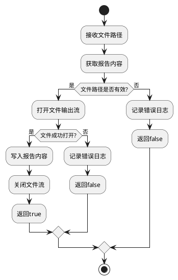

**TextReportGenerator::generateReport方法流程**

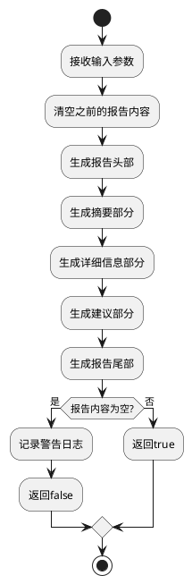

#### 错误处理

报告生成模块的错误处理主要体现在以下几个方面：

1. **文件操作错误**：
   - 当无法打开输出文件进行写入时，记录错误日志
   - 返回false，通知调用方写入失败
   - 详细记录文件路径和操作系统错误码，方便排查问题

2. **输入数据验证**：
   - 当输入参数无效或为空时，记录警告日志
   - 生成尽可能包含有效信息的报告，而不是完全失败
   - 在报告中标记数据可能不完整

3. **JSON序列化错误**：
   - 当JSON格式化过程中出现异常时，捕获并记录错误
   - 尝试生成部分JSON报告，确保关键信息不丢失
   - 如果无法恢复，则返回错误状态

4. **格式化错误**：
   - 处理格式化过程中可能出现的错误，如除零错误
   - 使用默认值或占位符代替无法格式化的内容
   - 确保报告格式的一致性和可读性

5. **内存使用考虑**：
   - 处理大型报告时注意内存使用
   - 对于超大文件的报告，考虑分块生成和写入
   - 避免在内存中保存完整的源文件内容 ### 工具模块设计

#### 模块功能

工具模块提供一系列通用的工具函数和类，为DLogCover系统的其他模块提供支持。该模块包含文件系统操作、字符串处理、日志记录、配置处理和JSON处理等功能，是系统的基础支持组件。

该模块的主要功能包括：
1. 提供文件系统相关操作，如文件读写、目录遍历、路径处理等
2. 提供字符串处理功能，如分割、替换、匹配等
3. 提供日志记录功能，支持不同级别的日志输出和文件日志
4. 提供配置处理功能，如配置项读取、验证和默认值设置
5. 提供JSON处理功能，如JSON解析、序列化和格式化

#### 主要接口

工具模块主要由几个不同功能的工具类组成，以下是它们的主要接口：

**FileUtils类**

```cpp
/**
 * @class FileUtils
 * @brief 文件工具类
 *
 * 提供文件系统相关操作的静态方法
 */
class FileUtils {
public:
    /**
     * @brief 检查文件是否存在
     *
     * @param path 文件路径
     * @return bool 文件是否存在
     */
    static bool fileExists(const std::string& path);

    /**
     * @brief 检查目录是否存在
     *
     * @param path 目录路径
     * @return bool 目录是否存在
     */
    static bool directoryExists(const std::string& path);

    /**
     * @brief 创建目录（如果不存在）
     *
     * @param path 目录路径
     * @return bool 创建是否成功
     */
    static bool createDirectory(const std::string& path);

    /**
     * @brief 获取文件大小
     *
     * @param path 文件路径
     * @return std::size_t 文件大小（字节）
     */
    static std::size_t getFileSize(const std::string& path);

    /**
     * @brief 读取文件内容
     *
     * @param path 文件路径
     * @return std::string 文件内容
     */
    static std::string readFile(const std::string& path);

    /**
     * @brief 写入文件内容
     *
     * @param path 文件路径
     * @param content 文件内容
     * @return bool 写入是否成功
     */
    static bool writeFile(const std::string& path, const std::string& content);

    /**
     * @brief 获取文件扩展名
     *
     * @param path 文件路径
     * @return std::string 扩展名
     */
    static std::string getFileExtension(const std::string& path);

    /**
     * @brief 获取文件名（不含路径）
     *
     * @param path 文件路径
     * @return std::string 文件名
     */
    static std::string getFileName(const std::string& path);

    /**
     * @brief 获取文件所在目录
     *
     * @param path 文件路径
     * @return std::string 目录路径
     */
    static std::string getDirectoryPath(const std::string& path);

    /**
     * @brief 递归获取目录下所有文件
     *
     * @param directoryPath 目录路径
     * @return std::vector<std::string> 文件路径列表
     */
    static std::vector<std::string> getFilesInDirectory(const std::string& directoryPath);

    /**
     * @brief 规范化路径，处理../和./等
     *
     * @param path 原始路径
     * @return std::string 规范化后的路径
     */
    static std::string normalizePath(const std::string& path);

    /**
     * @brief 将相对路径转换为绝对路径
     *
     * @param relativePath 相对路径
     * @return std::string 绝对路径
     */
    static std::string toAbsolutePath(const std::string& relativePath);
};
```

**StringUtils类**

```cpp
/**
 * @class StringUtils
 * @brief 字符串工具类
 *
 * 提供字符串处理相关操作的静态方法
 */
class StringUtils {
public:
    /**
     * @brief 分割字符串
     *
     * @param str 要分割的字符串
     * @param delimiter 分隔符
     * @return std::vector<std::string> 分割后的字符串列表
     */
    static std::vector<std::string> split(const std::string& str, char delimiter);

    /**
     * @brief 替换字符串中的子串
     *
     * @param str 原字符串
     * @param from 要替换的子串
     * @param to 替换为的子串
     * @return std::string 替换后的字符串
     */
    static std::string replace(const std::string& str, const std::string& from, const std::string& to);

    /**
     * @brief 去除字符串首尾的空白字符
     *
     * @param str 原字符串
     * @return std::string 处理后的字符串
     */
    static std::string trim(const std::string& str);

    /**
     * @brief 转换为小写
     *
     * @param str 原字符串
     * @return std::string 小写字符串
     */
    static std::string toLower(const std::string& str);

    /**
     * @brief 转换为大写
     *
     * @param str 原字符串
     * @return std::string 大写字符串
     */
    static std::string toUpper(const std::string& str);

    /**
     * @brief 检查字符串是否以指定子串开头
     *
     * @param str 原字符串
     * @param prefix 前缀
     * @return bool 是否以指定子串开头
     */
    static bool startsWith(const std::string& str, const std::string& prefix);

    /**
     * @brief 检查字符串是否以指定子串结尾
     *
     * @param str 原字符串
     * @param suffix 后缀
     * @return bool 是否以指定子串结尾
     */
    static bool endsWith(const std::string& str, const std::string& suffix);

    /**
     * @brief 格式化字符串
     *
     * @param format 格式字符串
     * @param ... 可变参数
     * @return std::string 格式化后的字符串
     */
    static std::string format(const char* format, ...);
};
```

**LogUtils类**

```cpp
/**
 * @enum LogSeverity
 * @brief 日志严重性级别
 */
enum class LogSeverity {
    DEBUG,      ///< 调试信息
    INFO,       ///< 一般信息
    WARNING,    ///< 警告信息
    ERROR,      ///< 错误信息
    FATAL       ///< 致命错误
};

/**
 * @class LogUtils
 * @brief 日志工具类
 *
 * 提供日志记录相关功能
 */
class LogUtils {
public:
    /**
     * @brief 初始化日志系统
     *
     * @param logFilePath 日志文件路径
     * @param minSeverity 最小记录级别
     * @return bool 初始化是否成功
     */
    static bool initialize(const std::string& logFilePath, LogSeverity minSeverity);

    /**
     * @brief 关闭日志系统
     */
    static void shutdown();

    /**
     * @brief 记录日志
     *
     * @param severity 日志级别
     * @param file 源文件名
     * @param line 行号
     * @param function 函数名
     * @param message 日志消息
     */
    static void log(LogSeverity severity, const char* file, int line, const char* function, const std::string& message);

    /**
     * @brief 设置最小记录级别
     *
     * @param severity 日志级别
     */
    static void setMinSeverity(LogSeverity severity);

    /**
     * @brief 获取当前最小记录级别
     *
     * @return LogSeverity 日志级别
     */
    static LogSeverity getMinSeverity();

    /**
     * @brief 获取日志严重性级别的字符串表示
     *
     * @param severity 日志级别
     * @return const char* 字符串表示
     */
    static const char* severityToString(LogSeverity severity);

private:
    static LogSeverity minSeverity_;         ///< 最小记录级别
    static std::ofstream logFile_;           ///< 日志文件流
    static std::mutex logMutex_;             ///< 日志互斥量，确保线程安全
};

// 日志宏定义，方便使用
#define LOG_DEBUG(message) LogUtils::log(LogSeverity::DEBUG, __FILE__, __LINE__, __FUNCTION__, message)
#define LOG_INFO(message) LogUtils::log(LogSeverity::INFO, __FILE__, __LINE__, __FUNCTION__, message)
#define LOG_WARNING(message) LogUtils::log(LogSeverity::WARNING, __FILE__, __LINE__, __FUNCTION__, message)
#define LOG_ERROR(message) LogUtils::log(LogSeverity::ERROR, __FILE__, __LINE__, __FUNCTION__, message)
#define LOG_FATAL(message) LogUtils::log(LogSeverity::FATAL, __FILE__, __LINE__, __FUNCTION__, message)
```

**JsonUtils类**

```cpp
/**
 * @class JsonUtils
 * @brief JSON工具类
 *
 * 提供JSON处理相关功能
 */
class JsonUtils {
public:
    /**
     * @brief 解析JSON字符串
     *
     * @param jsonStr JSON字符串
     * @return nlohmann::json JSON对象
     */
    static nlohmann::json parse(const std::string& jsonStr);

    /**
     * @brief 检查JSON对象是否包含指定键
     *
     * @param json JSON对象
     * @param key 键名
     * @return bool 是否包含
     */
    static bool hasKey(const nlohmann::json& json, const std::string& key);

    /**
     * @brief 获取JSON字符串
     *
     * @param json JSON对象
     * @param pretty 是否美化输出
     * @return std::string JSON字符串
     */
    static std::string toString(const nlohmann::json& json, bool pretty = false);

    /**
     * @brief 获取JSON中的字符串值，如果键不存在或类型不匹配则返回默认值
     *
     * @param json JSON对象
     * @param key 键名
     * @param defaultValue 默认值
     * @return std::string 字符串值
     */
    static std::string getString(const nlohmann::json& json, const std::string& key, const std::string& defaultValue = "");

    /**
     * @brief 获取JSON中的整数值，如果键不存在或类型不匹配则返回默认值
     *
     * @param json JSON对象
     * @param key 键名
     * @param defaultValue 默认值
     * @return int 整数值
     */
    static int getInt(const nlohmann::json& json, const std::string& key, int defaultValue = 0);

    /**
     * @brief 获取JSON中的布尔值，如果键不存在或类型不匹配则返回默认值
     *
     * @param json JSON对象
     * @param key 键名
     * @param defaultValue 默认值
     * @return bool 布尔值
     */
    static bool getBool(const nlohmann::json& json, const std::string& key, bool defaultValue = false);

    /**
     * @brief 获取JSON中的数组，如果键不存在或类型不匹配则返回空数组
     *
     * @param json JSON对象
     * @param key 键名
     * @return nlohmann::json 数组
     */
    static nlohmann::json getArray(const nlohmann::json& json, const std::string& key);
};
```

#### 错误处理

工具模块的错误处理主要体现在以下几个方面：

1. **文件操作错误**：
   - 当文件操作失败时，如无法打开文件、读写错误等，捕获异常并记录详细信息
   - 返回适当的错误状态，如false或空字符串，通知调用方操作失败
   - 提供详细的错误信息，方便调试和问题定位

2. **参数验证**：
   - 对输入参数进行严格验证，确保参数有效
   - 在参数无效时返回合理的默认值或错误状态
   - 避免出现未定义行为和程序崩溃

3. **内存安全**：
   - 使用现代C++的智能指针和RAII技术，避免内存泄漏
   - 注意处理大文件和大字符串的内存使用，避免内存不足
   - 对于可能的极端情况，提供内存使用限制和保护机制

4. **线程安全**：
   - 在日志记录等可能被多线程访问的功能中，使用互斥量确保线程安全
   - 明确文档中标注哪些方法是线程安全的，哪些不是
   - 避免在共享数据上的竞争条件

5. **JSON操作错误**：
   - 处理JSON解析和访问中可能出现的各种异常
   - 提供安全的访问方法，即使键不存在或类型不匹配也不会崩溃
   - 返回合理的默认值，确保程序可以继续运行 ## 实现计划

本章节描述DLogCover系统的实现计划，包括开发阶段划分、优先级安排和里程碑设定，为项目的实施提供时间线和路线图。

### 开发阶段划分

DLogCover系统的开发将分为以下几个阶段：

1. **准备阶段（2周）**
   - 环境搭建和依赖安装
   - 项目结构创建
   - 构建系统配置（CMake）
   - 版本控制设置（Git）
   - 开发规范确定

2. **核心功能实现阶段（6周）**
   - 命令行接口模块实现
   - 配置管理模块实现
   - 源文件管理模块实现
   - AST分析模块实现
   - 日志识别模块实现
   - 覆盖率计算模块实现
   - 报告生成模块实现
   - 工具模块实现

3. **测试与优化阶段（4周）**
   - 单元测试编写
   - 集成测试编写
   - 性能测试和优化
   - 内存泄漏检测和修复
   - 多平台兼容性测试

4. **文档和发布阶段（2周）**
   - 用户手册编写
   - 开发文档完善
   - 示例代码和用例准备
   - 安装包和发布包准备
   - 版本发布

### 优先级安排

各模块的开发优先级如下：

1. **最高优先级**
   - 工具模块（作为其他模块的基础支持）
   - 源文件管理模块（文件收集是第一步）
   - AST分析模块（核心功能，技术难度高）

2. **高优先级**
   - 日志识别模块（依赖AST分析模块）
   - 覆盖率计算模块（核心业务逻辑）
   - 配置管理模块（为其他模块提供配置）

3. **中优先级**
   - 命令行接口模块（用户交互界面）
   - 报告生成模块（结果展示）

4. **低优先级**
   - 高级特性和优化
   - UI界面（如果计划添加）
   - 与其他工具的集成

### 里程碑设定

项目实施过程中设定以下关键里程碑：

1. **里程碑1：基础架构完成**
   - 完成项目结构搭建
   - 完成工具模块实现
   - 完成配置管理模块实现
   - 可以读取配置文件并收集源文件

2. **里程碑2：核心分析功能实现**
   - 完成AST分析模块实现
   - 完成日志识别模块实现
   - 能够识别源文件中的日志调用点

3. **里程碑3：覆盖率统计功能实现**
   - 完成覆盖率计算模块实现
   - 完成报告生成模块基本功能
   - 能够生成基本的覆盖率报告

4. **里程碑4：完整功能集成**
   - 完成命令行接口模块实现
   - 完成所有模块的集成
   - 可以通过命令行运行完整的分析流程

5. **里程碑5：测试与优化完成**
   - 完成单元测试和集成测试
   - 完成性能优化
   - 修复已知问题和缺陷

6. **里程碑6：正式发布**
   - 完成文档编写
   - 完成发布包准备
   - 发布第一个正式版本 ## 测试策略

本章节描述DLogCover系统的测试策略，包括单元测试、集成测试和系统测试的计划，确保系统的质量和可靠性。

### 单元测试计划

单元测试将使用GoogleTest框架，针对各个模块的类和函数进行测试。单元测试的主要目标是验证各个组件在隔离环境中的正确性。

1. **测试覆盖率要求**
   - 代码行覆盖率达到80%以上
   - 函数覆盖率达到90%以上
   - 分支覆盖率达到70%以上

2. **测试范围**
   - 所有公共方法和函数
   - 关键的私有方法（通过友元类或特殊测试接口）
   - 错误处理和边界条件

3. **测试数据**
   - 正常输入数据
   - 边界条件数据
   - 异常情况数据
   - 空值和特殊值

4. **模块单元测试重点**
   - **工具模块**：文件操作、字符串处理、日志记录、JSON处理等工具函数
   - **配置管理模块**：配置加载、验证、合并、默认值应用等
   - **源文件管理模块**：文件收集、过滤、路径处理等
   - **AST分析模块**：AST遍历、代码结构识别等
   - **日志识别模块**：日志函数调用识别、日志级别分类等
   - **覆盖率计算模块**：各类型覆盖率计算、统计数据生成等
   - **报告生成模块**：报告格式化、文件输出等

### 集成测试计划

集成测试将验证各个模块之间的交互和系统作为一个整体的功能正确性。

1. **测试策略**
   - 自底向上的集成测试，从低层模块开始
   - 每次集成一个或多个模块，验证其与已集成模块的交互

2. **测试场景**
   - **源文件收集与AST分析**：验证源文件管理模块能够正确收集文件并传递给AST分析模块
   - **AST分析与日志识别**：验证AST分析结果能够被日志识别模块正确使用
   - **日志识别与覆盖率计算**：验证日志调用点信息能够被覆盖率计算模块正确处理
   - **覆盖率计算与报告生成**：验证覆盖率统计数据能够被报告生成模块正确展示
   - **命令行接口与整体流程**：验证通过命令行可以正确控制整个分析流程

3. **测试数据集**
   - 小型示例代码
   - 中等规模的真实项目
   - 大型开源项目

### 系统测试计划

系统测试将验证整个DLogCover系统的功能、性能和可用性。

1. **功能测试**
   - 验证所有需求的实现
   - 验证所有功能的正确性
   - 验证配置选项的有效性

2. **性能测试**
   - 资源使用（CPU、内存）测试
   - 大型项目的扫描时间测试
   - 扩展性测试（处理大量文件和复杂代码）

3. **兼容性测试**
   - 多操作系统测试（Linux、Windows、macOS）
   - 不同编译器版本测试
   - 不同C++标准测试（C++11、C++14、C++17）

4. **压力测试**
   - 超大代码库测试
   - 高并发分析测试（如果支持）
   - 资源限制下的行为测试

### 测试自动化

1. **持续集成设置**
   - 使用GitHub Actions或Jenkins设置CI管道
   - 每次提交自动运行单元测试
   - 定期运行集成测试和系统测试

2. **测试报告生成**
   - 生成覆盖率报告
   - 生成测试结果报告
   - 发现问题自动创建Issue ## 部署说明

本章节描述DLogCover系统的部署和安装方法，包括环境要求、安装步骤和配置说明。

### 部署环境要求

1. **操作系统**
   - Linux（推荐Ubuntu 18.04或更高版本）
   - Windows（Windows 10或更高版本）
   - macOS（10.14或更高版本）

2. **软件依赖**
   - CMake 3.10或更高版本
   - C++17兼容的编译器
     - GCC 7.0+
     - Clang 6.0+
     - MSVC 19.14+（Visual Studio 2017 15.7或更高版本）
   - LLVM/Clang开发包9.0或更高版本
   - JSON库（如nlohmann/json，将通过CMake自动下载）
   - GoogleTest（用于测试，将通过CMake自动下载）

3. **硬件要求**
   - 至少4GB RAM（推荐8GB或更多）
   - 至少2GB可用磁盘空间
   - 多核CPU（推荐4核或更多）

### 安装步骤

#### 从源码构建

1. **克隆仓库**
   ```bash
   git clone https://github.com/yourusername/dlogcover.git
   cd dlogcover
   ```

2. **创建构建目录**
   ```bash
   mkdir build
   cd build
   ```

3. **配置项目**
   ```bash
   cmake ..
   ```

4. **编译项目**
   ```bash
   cmake --build . --config Release
   ```

5. **安装**
   ```bash
   cmake --install . --prefix /usr/local
   ```

#### 使用包管理器安装（计划支持）

1. **Debian/Ubuntu**
   ```bash
   sudo apt update
   sudo apt install dlogcover
   ```

2. **Fedora/RHEL**
   ```bash
   sudo dnf install dlogcover
   ```

3. **Arch Linux**
   ```bash
   sudo pacman -S dlogcover
   ```

4. **Windows (via Chocolatey)**
   ```bash
   choco install dlogcover
   ```

5. **macOS (via Homebrew)**
   ```bash
   brew install dlogcover
   ```

### 配置说明

1. **全局配置文件**
   - 安装后，全局配置文件位于`/etc/dlogcover/config.json`（Linux/macOS）或`C:\ProgramData\DLogCover\config.json`（Windows）
   - 用户可以复制此文件到自己的目录中进行自定义

2. **用户配置文件**
   - 用户可以在`~/.config/dlogcover/config.json`（Linux/macOS）或`%USERPROFILE%\.dlogcover\config.json`（Windows）创建个人配置文件
   - 用户配置会覆盖全局配置

3. **项目配置文件**
   - 每个项目可以在项目根目录创建`.dlogcover.json`配置文件
   - 项目配置会覆盖用户配置和全局配置

4. **命令行参数**
   - 命令行参数可以覆盖所有配置文件中的设置
   - 使用`dlogcover --help`查看所有可用命令行参数 ## 性能考量

本章节描述DLogCover系统的性能设计考量，包括性能指标、优化策略和资源使用限制，确保系统在处理大型代码库时也能保持良好的性能。

### 性能指标

DLogCover系统应当满足以下性能指标：

1. **扫描速度**
   - 单个C++源文件（约1000行）的处理时间不超过1秒
   - 10万行代码项目的完整分析时间不超过5分钟
   - 100万行代码项目的完整分析时间不超过30分钟

2. **内存使用**
   - 基本内存占用不超过200MB
   - 处理大型文件（>10000行）时，峰值内存不超过1GB
   - 处理100万行代码项目时，峰值内存不超过4GB

3. **CPU利用率**
   - 支持多线程分析，提高CPU利用率
   - 单个文件分析过程中，CPU利用率不超过100%（单核）
   - 多文件并行分析时，平均CPU利用率不超过70%（多核）

### 优化策略

1. **编译和链接优化**
   - 使用编译优化标志（-O2或-O3）
   - 使用链接时优化（LTO）
   - 使用适当的内联策略

2. **内存使用优化**
   - 避免不必要的大对象复制
   - 使用视图和引用替代复制
   - 对大型数据结构使用分块处理
   - 及时释放不再需要的资源

3. **算法优化**
   - 使用高效的数据结构和算法
   - 对热点路径进行性能分析和优化
   - 避免重复计算和处理
   - 使用缓存提高频繁访问数据的效率

4. **并行化策略**
   - 文件级并行：不同源文件的分析可以并行进行
   - 任务级并行：将分析任务分解为可并行的子任务
   - 使用工作池模式管理并行任务
   - 适当设置任务粒度，平衡并行度和调度开销

5. **I/O优化**
   - 批量读取文件内容
   - 使用内存映射文件处理大文件
   - 异步I/O操作
   - 减少文件系统访问次数

### 资源使用限制

1. **内存限制**
   - 提供配置选项限制最大内存使用
   - 在接近限制时采取措施（如分块处理、垃圾回收）
   - 在超出限制时优雅降级（如跳过某些大文件）

2. **CPU限制**
   - 提供配置选项限制使用的CPU核心数
   - 支持优先级设置，避免系统资源争用
   - 提供后台模式，降低CPU使用率

3. **磁盘空间管理**
   - 定期清理临时文件
   - 压缩历史报告
   - 提供配置选项限制日志文件大小

4. **超时机制**
   - 对单个文件分析设置超时时间
   - 对整个项目分析设置最大运行时间
   - 在超时后提供部分结果 ## 安全性考量

本章节描述DLogCover系统的安全性设计考量，包括潜在的安全风险和防护措施，确保系统在分析代码时不会引入安全问题。

### 潜在安全风险

1. **源代码访问风险**
   - 分析过程中访问可能包含敏感信息的源代码
   - 生成的报告可能包含代码片段或路径信息

2. **外部依赖风险**
   - 第三方库可能存在漏洞
   - 构建和安装过程可能引入恶意代码

3. **资源耗尽风险**
   - 处理恶意构造的输入文件可能导致资源耗尽
   - 无限递归或循环可能导致拒绝服务

4. **权限提升风险**
   - 在需要特权的环境中运行可能带来权限提升风险

### 安全措施

1. **源代码保护**
   - 分析过程完全在本地进行，不向外部发送代码
   - 报告中的代码片段可选择性脱敏或省略
   - 临时文件使用安全的方式创建和删除
   - 敏感信息（如密钥、密码）检测和屏蔽

2. **依赖管理**
   - 固定依赖库的版本号
   - 验证下载的依赖包的完整性（校验和、签名）
   - 定期更新依赖以修复已知漏洞
   - 尽量减少外部依赖数量

3. **输入验证和资源限制**
   - 对输入文件进行验证，拒绝可疑文件
   - 实施资源限制（内存、CPU时间）
   - 检测并中断潜在的无限循环
   - 实施超时机制，防止分析过程挂起

4. **最小权限原则**
   - 不要求管理员权限运行
   - 只访问指定目录中的文件
   - 不修改源代码文件，只读取
   - 配置文件和报告使用用户权限存储

5. **安全编译和构建**
   - 启用编译器安全选项（栈保护、ASLR等）
   - 静态分析检查潜在的安全问题
   - 模糊测试验证处理异常输入的能力
   - 使用安全的构建和发布流程 ## 维护与升级计划

本章节描述DLogCover系统的维护和升级计划，包括版本管理、Bug修复策略和特性增强路线图，确保系统能够长期稳定运行并持续改进。

### 版本管理策略

1. **版本号方案**
   - 采用语义化版本号（Semantic Versioning）：主版本号.次版本号.修订号
   - 主版本号：不兼容的API变更
   - 次版本号：向下兼容的功能新增
   - 修订号：向下兼容的问题修复

2. **发布周期**
   - 主版本：每年1-2次
   - 次版本：每季度1次
   - 修订版本：根据需要随时发布
   - 安全更新：发现严重安全问题时立即发布

3. **长期支持计划**
   - 每两年指定一个LTS（长期支持）版本
   - LTS版本提供至少2年的维护和安全更新
   - 非LTS版本提供至少6个月的维护

### Bug修复策略

1. **Bug分类**
   - 严重性：关键、高、中、低
   - 影响范围：所有用户、特定配置、特定平台、特定使用场景

2. **修复优先级**
   - 安全漏洞：最高优先级，立即修复
   - 数据丢失或损坏问题：高优先级，下一个修订版本修复
   - 功能缺陷：中等优先级，计划在未来修订版本修复
   - 次要问题：低优先级，可能延迟修复或不修复

3. **回溯修复策略**
   - 安全漏洞和关键bug会回溯到所有支持中的版本
   - 其他bug通常只在最新版本中修复

### 特性增强路线图

1. **短期计划（6个月内）**
   - 完善Qt日志识别，支持更多的Qt日志函数和用法
   - 添加批量分析模式，支持多项目同时分析
   - 改进报告生成，提供更直观的可视化表示
   - 提高性能，优化大型项目的分析速度

2. **中期计划（6-18个月）**
   - 添加图形用户界面（GUI）
   - 支持更多C++编译器和特殊语法
   - 增加与CI/CD系统的集成
   - 添加历史数据比较功能，跟踪覆盖率变化

3. **长期计划（18+个月）**
   - 支持其他编程语言（如Java、Python）
   - 添加智能建议系统，基于机器学习提供日志添加建议
   - 开发插件系统，支持社区扩展
   - 构建云服务版本，支持团队协作和远程分析

### 兼容性维护

1. **向后兼容策略**
   - 配置文件格式保持向后兼容
   - 命令行接口保持稳定
   - API变更遵循弃用周期，主版本更新前预先通知

2. **平台支持策略**
   - 持续支持主流Linux发行版、Windows和macOS
   - 定期评估新平台支持需求
   - 废弃对过时平台和编译器的支持（提前通知）

3. **依赖管理**
   - 定期更新第三方依赖库版本
   - 评估新依赖引入的必要性和风险
   - 考虑将关键依赖内部化，减少外部依赖 ## 结论

本文档详细描述了DLogCover C++日志覆盖率统计工具的详细设计，包括系统各模块的设计、实现计划、测试策略、部署说明、性能考量、安全性考量以及维护与升级计划。文档旨在为开发团队提供清晰的实现指南，确保系统能够按照设计要求高质量地实现。

DLogCover系统的设计遵循了模块化、可扩展性和高性能的原则。通过基于Clang/LLVM的AST分析技术，系统能够精确识别C++代码中的日志函数调用，并计算各种级别的日志覆盖率指标，帮助开发团队改进代码质量和可维护性。

系统的实现计划分为准备、核心功能实现、测试与优化、文档和发布四个阶段，共计14周的开发周期。测试策略覆盖了单元测试、集成测试和系统测试，确保系统的质量和可靠性。部署说明提供了详细的环境要求和安装步骤，方便用户快速部署使用。

性能和安全性设计考量确保了系统在处理大型代码库时的效率和安全性。维护与升级计划则为系统的长期发展提供了清晰的路线图。

随着系统的开发和应用，可能需要根据实际情况对设计进行调整和完善。开发团队应定期回顾本设计文档，确保实现与设计保持一致，并及时更新文档以反映实际实现。

---

**文档版本历史**

| 版本 | 日期 | 作者 | 变更说明 |
|------|------|------|----------|
| 0.1 | 2023-06-01 | 初始团队 | 初始版本 |
| 0.2 | 2023-06-15 | 设计团队 | 添加模块详细设计 |
| 1.0 | 2023-07-01 | 设计团队 | 完成全部章节，发布正式版本 |
