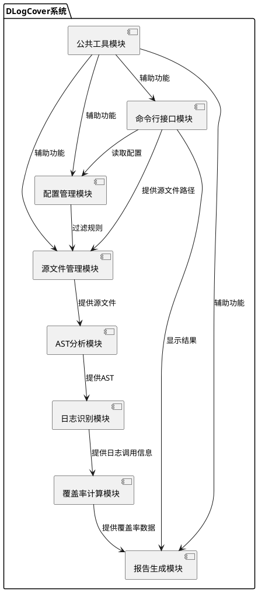

# DLogCover - C++日志覆盖率统计工具详细设计文档

## 概述

### 目的

本文档是针对DLogCover系统给出的系统详细设计文档，在本文档中，将给出DLogCover系统的系统设计原则、关键静态结构设计、关键动态流程设计、数据结构设计、非功能性设计、系统部署与实施设计等内容。

DLogCover系统的系统设计与实现基于DLogCover系统的需求分析，总体上将结合形式化设计的方法与文字描述，给出半形式化的概要设计与低层设计，与需求分析内容的相对应，以保证系统设计的严谨性与可实现性。在形式化部分，本文档将主要采取UML语言的包图、类图、序列图等进行系统设计。

本文档的适用读者为DLogCover系统的产品经理、设计人员、开发人员、测试人员以及后续维护人员。

### 术语说明

- **AST**：抽象语法树(Abstract Syntax Tree)，是源代码的抽象语法结构的树状表示，树上的每个节点都表示源代码中的一个结构。

- **日志覆盖率**：代码中包含日志记录的比例，用于评估代码是否在关键路径上有足够的日志记录以便于问题定位和系统监控。

- **Clang/LLVM**：一个C/C++/Objective-C编译器前端和工具链技术的集合，提供了丰富的源代码分析能力。

- **LibTooling**：Clang提供的一个库，允许开发者编写独立的工具来分析C++源代码。

- **函数级日志覆盖率**：在函数级别评估日志记录的覆盖情况，即有多少函数包含了日志记录。

- **分支路径日志覆盖率**：在代码分支级别评估日志记录的覆盖情况，即有多少代码分支（if-else、switch-case等）包含了日志记录。

- **异常处理路径日志覆盖率**：在异常处理路径（try-catch块）级别评估日志记录的覆盖情况。

- **ASTMatcher**：Clang提供的一种基于模式匹配的AST节点查找机制，可以用于在AST中查找特定类型的节点。

- **ASTVisitor**：Clang提供的一种遍历AST的机制，可以用于访问AST中的所有节点。

- **JSON**：JavaScript Object Notation，一种轻量级的数据交换格式，易于人阅读和编写，也易于机器解析和生成。

### 参考资料

- DLogCover产品需求文档 (产品需求文档.md)
- DLogCover概要设计文档 (概要设计文档.md)
- Clang LibTooling文档：https://clang.llvm.org/docs/LibTooling.html
- Clang AST Matcher文档：https://clang.llvm.org/docs/LibASTMatchers.html
- Modern C++(C++17)标准：https://en.cppreference.com/w/cpp/17
- JSON for Modern C++库文档：https://github.com/nlohmann/json

## 模块设计

### 设计约束

DLogCover项目在实现时应遵循以下设计约束：

1. **源代码目录结构**：
   - 遵循标准的CMake项目目录结构
   - include目录存放对外公开的头文件
   - src目录存放源代码实现
   - tests目录存放单元测试代码
   - examples目录存放示例代码
   - docs目录存放文档

2. **编码规范**：
   - 遵循Google C++编码规范
   - 类名使用大驼峰命名法（如`CommandLineParser`）
   - 函数名和变量名使用小驼峰命名法（如`parseArguments`）
   - 私有成员变量以下划线结尾（如`config_`）
   - 常量使用大写字母和下划线（如`MAX_BUFFER_SIZE`）
   - 每个源文件和头文件都应包含版权声明和文件说明

3. **版权声明**：
   ```cpp
   /**
    * Copyright (c) 2023 DLogCover Contributors
    * 
    * DLogCover - C++日志覆盖率统计工具
    * 文件：[文件名]
    * 功能：[功能描述]
    */
   ```

4. **单元测试要求**：
   - 使用GoogleTest框架进行单元测试
   - 核心功能模块的代码覆盖率应达到80%以上
   - 单元测试应包含正常用例和异常用例

5. **构建工具**：
   - 使用CMake作为构建系统
   - 支持在Linux、macOS和Windows平台上构建
   - 提供便捷的构建脚本

6. **第三方依赖管理**：
   - 使用CMake ExternalProject或FetchContent管理第三方依赖
   - 尽可能减少外部依赖，必要的依赖应明确版本要求

7. **错误处理**：
   - 使用异常处理机制处理严重错误
   - 使用返回值或状态码处理可恢复的错误
   - 所有公共API都应提供明确的错误处理机制

8. **文档要求**：
   - 使用Doxygen格式编写API文档
   - 公共接口必须有完整的文档注释
   - 复杂算法或逻辑应提供详细的实现说明

9. **性能要求**：
   - 符合产品需求文档中的性能指标
   - 关键路径上的代码应进行性能优化
   - 大型文件处理应采用流式或分块处理

### 系统模块设计

DLogCover系统的整体架构使用分层设计，总共包含七个主要模块。系统模块结构如下：



#### 模块依赖关系

本系统的编译和运行时均依赖于以下软硬件：

1. **编译时依赖**：
   - C++17兼容的编译器（GCC 7+, Clang 5+, MSVC 2019+）
   - CMake 3.13或更高版本
   - LLVM/Clang库（版本10.0.0或更高）
   - nlohmann/json库（版本3.9.0或更高）
   - CLI11库（版本2.1.0或更高）
   - GoogleTest（仅测试时需要，版本1.10.0或更高）

2. **运行时依赖**：
   - 现代Linux、macOS或Windows操作系统
   - LLVM/Clang库运行时组件

#### 模块详细说明

1. **命令行接口模块**：
   - 是系统的入口点，负责解析命令行参数
   - 根据命令行参数调用相应的功能模块
   - 提供帮助信息和错误处理
   - 主要类：`CommandLineParser`、`ProgramOptions`

2. **配置管理模块**：
   - 负责读取和解析配置文件
   - 提供默认配置值
   - 合并命令行参数和配置文件
   - 主要类：`ConfigManager`、`Configuration`

3. **源文件管理模块**：
   - 根据配置收集需要分析的源文件
   - 过滤符合条件的文件
   - 读取文件内容
   - 主要类：`SourceCollector`、`SourceFile`、`FileFilter`

4. **AST分析模块**：
   - 使用Clang/LLVM库解析C++源代码
   - 生成和遍历抽象语法树
   - 识别代码中的函数、分支和异常处理
   - 主要类：`ASTAnalyzer`、`ASTUnit`、`ClangTool`

5. **日志识别模块**：
   - 识别代码中的日志函数调用
   - 区分不同类型和级别的日志
   - 记录日志位置信息
   - 主要类：`LogIdentifier`、`LogCall`、`LogFunctionMatcher`

6. **覆盖率计算模块**：
   - 计算各种覆盖率指标
   - 分析日志级别分布
   - 标识未覆盖的代码路径
   - 主要类：`CoverageCalculator`、`CoverageResults`

7. **报告生成模块**：
   - 格式化覆盖率结果
   - 生成文本或JSON格式报告
   - 提供覆盖率统计和建议
   - 主要类：`ReportGenerator`、`TextReportFormatter`、`JsonReportFormatter`

8. **公共工具模块**：
   - 提供日志、文件操作、字符串处理等通用功能
   - 提供异常和错误处理机制
   - 主要类：`Logger`、`FileUtils`、`StringUtils`、`Exception` 